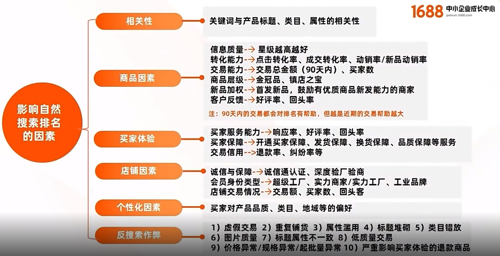

生意增长 成交力 （买家体验）= （产品力+服务力）× 获客力

+ 成交力：
  30天GMV 30天买家数
+ 产品力：
  当天在线商品数
  当天五星商品数
  当天行家选和品牌正品总数
+ 服务力
  30天旺旺响应率
  30天发货履约率
  90天纠纷率
+ 获客力
  30天访客数

## 年度规划

https://club.1688.com/unithread/233837758.html

运营工作规划
https://www.xiaohongshu.com/explore/62c2af02000000000a001af8

## 日常工作

### 发动态
做视频 发动态

### 看数据
1、每天统计分析数据分析

看前1天、近3天、近7天、近30天的数据变动情况，来分析出数据是否有异常，这里建议用Excel表格做一个折线图，可以很直观地看出数据的起伏情况。

2、看店铺整体流量

展现、点击、访客、浏览量，点击率、转化率、跳失率，这几项都是平台的核心数据，第一步先弄懂这些数据的概念，其背后反映出什么问题：

（1）展现——与产品排名、关键词覆盖面、广告推广情况有关；

（2）点击——与关键词和访客的精准度、图片视觉效果有关；

（3）访客——与产品排名、进店词、访客地域有关；

（4）跳失率——与访客是否精准、详情内容有关；

第二步是要清楚这些数据之间的关系，假设曝光飙升，但访客和浏览量没有随之上升，可以往流量的精准度方面做分析，判断带来的是虚曝光，还是有用的曝光；如果展现、访客和浏览量三者都呈上升趋势，店铺流量也比较精准情况下，可以注意点击转化率、线索和询盘转化率的情况，很大可能是跟产品本身有关。

3、看推广计划的数据

看哪些方面？

（1）预算是否有消耗完，分析消耗不出去是什么原因；

（2）计划的展现、点击、转化是否有异常，优秀点击率的标准可以参考同行同层优秀；

（3）看产品和词，哪些产品产生了展现、点击，哪些带来了访客和反馈，只有展现没有点击，或者高点击没有反馈，都属于异常产品；

（4）看点击成本和线索成本，这个要结合预算和出价水平来看。

4、分析进店关键词：

（1）看带来展现和访客的词有哪些，这些词是不是适合店铺产品的词，不符合说明不精准；

（2）看带来访客的产品有哪些，这个产品与和搜索词是否匹配，带来不精准流量的产品可能产品的标题或者属性导致，这个可以应用到后面产品优化上。
5、结合以上几点，可以分析出整体的店铺效果，流量是否精准，适用于分析1天，近7天，近30天的数据分析，最终可以得出平台有效产品与关键词是哪些。

## 流量分析

### 流量场景分布

+ 横向及活动场景流量
  找货源 找工厂 找工业品
  伙拼 代发
  直播
+ 主站搜索流量
  
    
  动效率=最近30成交/商品总数 新品动效率
  复购率 支付转化率
+ 行业频道
  类目产品
+ 各类特色榜单
  必找××榜
+ 为你推荐

现货流量场景：
+ 直播
+ 伙拼/特卖/行业精选场景
+ 分销场景
  淘货源 抖商专供 跨境专供
+ 行业活动/商人节大促

[搜索及现货场景流量](https://peixun.1688.com/course/video.htm?spm=a26eo.10621422.0.0.2f04712aWJDFyX&code=PX00263R3)

### 指数分析

“全网搜索指数”就是根据用户搜索行为的相关指标来综合计算得出的，指标越高，表示搜索数据越多，也就表示这一关键词的热度越高。因此你会发现，通常大词和精准词的搜索指数都是比较高的。

“全网供需指数”是指在这一段时间内，网站内通过这一关键词搜索该商品的人数多少，以及有在上架售卖的这款产品总数量。供需指数越大，说明客户需求比较大，而网站商品供给比较少，也就意味着有一定的市场空间。

## 基础功

+ 店铺星级
+ 卖家L等级
+ 生意通等级

### 店铺基础

公司介绍=》主营行业（类目） 主要产品（长尾词）

店铺分数

### 基本设置
安心购
诚意赊

### 商品成长
新品 =》潜力品=》金冠=》镇店之宝

讲解视频 发动态 榜单 打爆

新品成长
https://www.yuque.com/youqing-wh92o/gm7g8v/ovqk0r

价格力商品
https://www.yuque.com/dianxia-9fqgd/uu6fge/yd1n4sqzb0my2hqz?spm=krump.krump-page-1735.0.0.53ee7u7H7u7HPy
https://www.yuque.com/youqing-wh92o/gm7g8v/yd1n4sqzb0my2hqz?spm=krump.krump-page-1735.0.0.3f598hVi8hVi5R

行业标签
https://act.1688.com/home/topicDetail.htm?tid=40376

## 会员系统

1688五指诊断法第①势-五指法 https://peixun.1688.com/course/detail.htm?spm=a26eo.10621448.0.0.56ee712anNTqKC&code=PX0026ZDR

https://peixun.1688.com/course/detail.htm?spm=a26eo.10621448.0.0.56ee712anNTqKC&code=PX0027063

https://peixun.1688.com/course/detail.htm?spm=a26eo.10621448.0.0.56ee712anNTqKC&code=PX0026FBA

运营接手阿里平台要做哪些工作 https://zhuanlan.zhihu.com/p/603178108
1688运营每天工作内容有哪些 https://zhuanlan.zhihu.com/p/557379951

### 客户运营

会员等级设置

开启会员体系CRM:
https://customer.crm.1688.com/page/memberManager.htm
获取客户线索 入会有礼 设置入会有礼券，吸引买家留下联系方式，方便后续挖掘优质客户； 吸引客户领取会员卡，后续可通过【旺旺会员管家】+【动态号】+【短信】群发新品、优惠券、活动通知；每人限领1张

老客复购

### 私域运营

1688微信分店
https://www.yuque.com/caroline-xw5cd/lhf0t5/vml9fh7w9uqqqfoa?singleDoc#

### 分销
一件代发 代发包邮

站外分销

分销模式介绍
商家授权商品后，第三方平台将通过API获取商品信息并展现在自有平台上，买家在其平台完成交易后。第三方平台会通过API向1688商家进行下单，商家根据收货地址正常发货即可。整个过程不会产生任何佣金

双11必备 | 【分销管理】如何一站式轻松拓展分销生意
https://club.1688.com/unithread/452961972.html?spm=a260n.12097937.jo3r16j6.29.7af66066EkKi9J&object_sub_type=topline_news&object_type=topline_news&pvid=26a33589-9bc4-414a-b043-d9c32d6a3b49&scm=1007.27849.162226.0&object_id=10&traceId=213e212d16997658861036361e2f00&__track_scene=toutiao

敲黑板！分销订单与跨境分销大买家获取秘籍！
https://club.1688.com/unithread/456222029.html?spm=a260n.12097937.jo3r16j6.23.7af66066EkKi9J&object_sub_type=topline_news&object_type=topline_news&pvid=26a33589-9bc4-414a-b043-d9c32d6a3b49&scm=1007.27849.162226.0&object_id=7&traceId=213e212d16997658861036361e2f00&__track_scene=toutiao

自动分账 分账管理 https://www.yuque.com/qe2gu6/hgp99r/tgbvq6vc5q1330fv?spm=a2629j.8538216.autotrace-fx_common_app.1.315625b20ys2QJ&singleDoc

## 广告系统 - 营销
新客宝
Plus会员

专场活动报名

## 物流

1688官方物流发货操作流程指导

https://club.1688.com/unithread/207355860.html?spm=a262a.ap-detail.0.0.7ba85ee9GZgLvP&srcContentId=321209221&srcContentId=368560295

亲，您可以自己打印面单也可以选择让网点打印面单，如果您选择让网点打印面单，请在货物外包装上用记号笔标注好收发货人的信息；避免串货； mini小件需要您自己打印面单贴好，具体的您可以参考：https://club.1688.com/unithread/208471513.html 

## 跨境
https://global.1688.com

https://peixun.1688.com/cms/qqgh.html?spm=a262eq.21804823.klrfpn1c.2.56ac3ef3b39mhU

### 
### 寻源通
1688跨境“寻源通”分别针对跨境ERP、跨境代采商、跨境超买和SaaS,为他们提供基于 AI 技术的搜索比价引擎,通过和官方合作把1688的1亿+官方源头货盘铺出去。
跨境代采商pandabuy、跨境服务商普源软件等数十个分销商,接入寻源通不到一个月的时间,已经实现了生意的几倍甚至十几倍的增长

