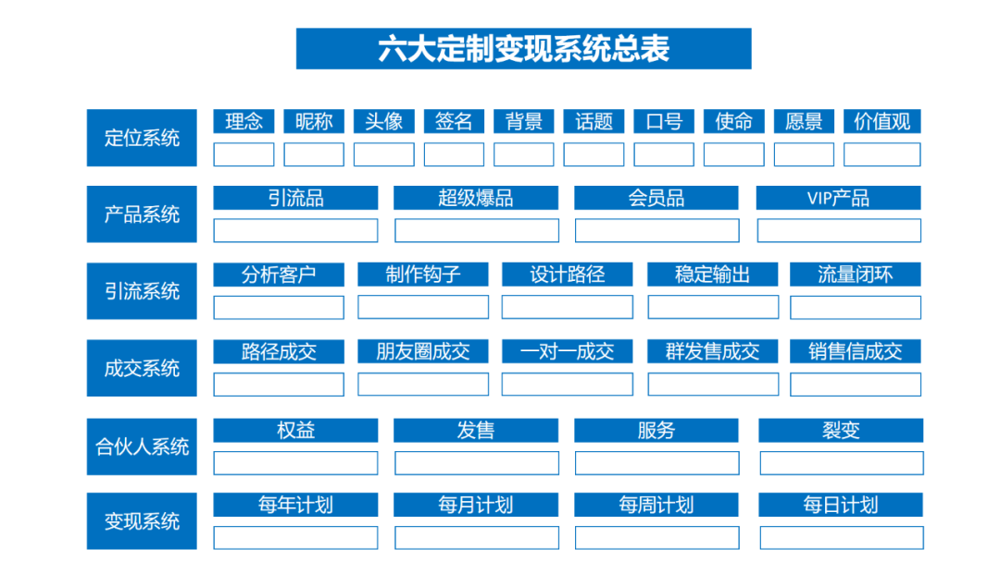
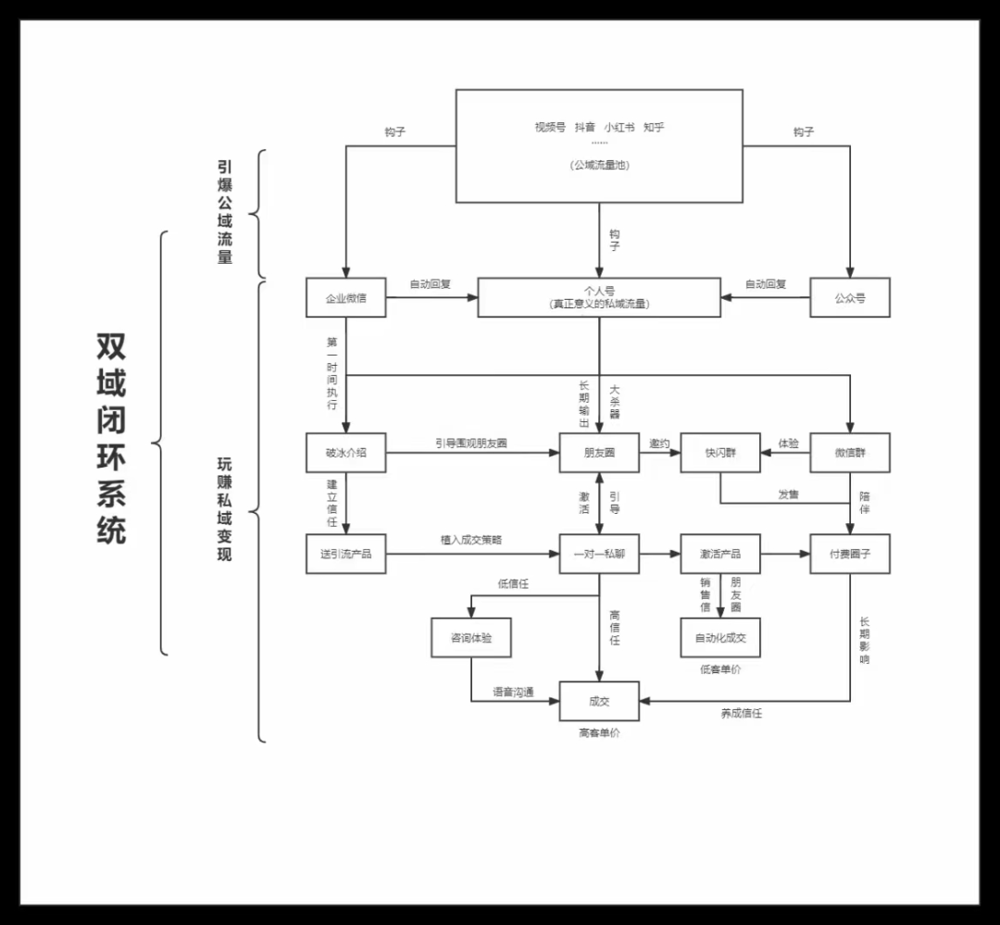

电商生意 = （产品力+服务力）×获客力×品牌力

## B2B B2C C2M
Consumer-to-manufacturer (C2M) 
MCN全称为Multi-Channel Network，主要依托电商、社交、视频等平台，整合内容创作者资源（如网红、UP主、大V等），进行持续内容生产、输出并实现商业变现。MCN机构具体业务主要为网红签约、孵化、内容创作、社区运营、内容分发、平台对接等。
https://zhuanlan.zhihu.com/p/412692348

单品

GMW

GMV Gross Merchandise Volume 成交总额

Milk Run 上门取件

Word first 万里汇

PQI Product Quality Indicator 商品质量指数

PV Page View 页面浏览量/点击量

UV Unique Visitor 访问人数

IPV Item Page View 搜索浏览量

IPV-UV 浏览过商品详情的独立访问者

补单就是补销量、补好评，说白了就是补店铺的综合数据

## 概论

### 公域私域联动-闭环自动化系统

做任何项目之前，一定遵循四部曲：战略——组织——流程——迭代。

战略解决头部统筹问题；

组织解决谁来干的问题；

流程解决如何执行问题；

迭代解决如何优化问题

设计一套自动化赚钱系统：前端引流获客——中端知识付费——后端保险超市。

最终形成产品体系如下：

引流产品：保险资料包，一对一保险咨询/测试方案等

爆款产品：实用保险课堂

后端产品：保险超市产品

小结保险成交系统路径设计：

微信好友——付费加入保险课堂——1V1私人保险咨询——匹配保险方案——续保/增购/转介绍/增员。

### IP打造过程

1.变现路径

2.账号定位

3.内容规划
内容需要有系列性，有主题，有延续

4.内容输出
持续的内容输出，所以要定一个节奏，一天一更，一周一更，都行。而且最好是定期更。比如罗辑思维就是早上6点更。晚上要让用户养成定期来看内容的习惯。

5.后端私域运营
短视频是目前最主流的内容呈现形式，但未必是流量最稳定的。今天发一个视频有10万的播放量，明天发的可能只有几千，这种很正常。

而且短视频和用户的互动除了点赞评论，很难有深入的交流。

所以，现在很多大的博主都把流量导入私域，用个人微信+企业微信+社群+公众号的综合私域布局，和用户更好地互动，也大幅提高了成交率和复购率。

#### 直播
无人直播实操教程，如何搭建属于自己的无人直播间，价值过W的技术免费奉上
https://mp.weixin.qq.com/s/Fs1SZq60wYOsl36__kdPhQ

#### 书单号
ChatGPT变现实操教程，照着做就能月入过万，不是标题党
https://mp.weixin.qq.com/s/BXr34o4xO9Jh0VQSCVgO_A

盘商品

盘客户

盘数据

谷歌系广告自动化进程分享 https://mp.weixin.qq.com/s/_bukUIWt-YdHQpigVLwRPQ

## 规模化 - 复制 矩阵
### 进销存系统
https://gitee.com/Loongdom/DBErp

## 市场调研
假设我现在有个需求，想快速搜集并构建一个关于德国厨具用品的信息源，来方便我做用户调研与产品研究。

比如，第一步我想了解德国人的生活方式，我可以在 AI 工具上搜索“德国人最经常访问的 20 个网站是什么，分别是关于什么主题的”。
紧接着我可以再细分点，在 AI 工具上搜索“德国人最经常访问的家居厨具类网站是什么”。
当然，具体的 Prompt 可以再具体点（例如：德国人最喜欢的家居厨具论坛），去分析具体的需求。

基于上面的信息，我便能清楚知道德国用户一般喜欢去哪里浏览信息，也知道了目前在德国市场上，关于家居厨具类产品有哪些大的在线零售网站。

接着我想知道目前市场上有哪些大的家居品牌，好让我做竞争对手调研。

基本上到这一步，德国用户经常去哪里、经常逛哪些家居类网站、且市场上流行的家居品牌有哪些，脑海里便有了一个初步了解。可以基于以上信息，建立一个初步的调研方向出来。

在整理信息源的过程中，如果有任何不明白的点，完全可以继续在 AI 工具中进行搜索。比如，我想继续了解“Grohe”这个卫浴品牌提供的产品有哪些，具体的型号等信息。

## 思维

流量密码
我用这个方法1个月赚了10万 https://mp.weixin.qq.com/s/zbRKjNVbX67UA3dBtJxrBQ

工厂如何找贸易公司

跨境电商品牌案例分析：一双拖鞋席卷东南亚！年销十亿背后的秘密！
https://mp.weixin.qq.com/s/zixL_Hyjc-MI7J9lj7I9wg

“买全球”“卖全球”，跨境电商今年实现了哪些新“跨”越？
https://mp.weixin.qq.com/s/tdRQjsgNhIDRjKOJ4vBsWQ

两个男人卖女装，年销3亿，回头客10万+，拿下热卖榜第一
https://mp.weixin.qq.com/s/XSjLvj4BOAxcWunbE2sXsg

卖晚礼服，独立站1天5W美金原来是这样做到的
https://mp.weixin.qq.com/s/6kW3R_JcNYGW7IEYGvHHWA

跨境电商|如果有可能，我建议你别再卖低价了
https://mp.weixin.qq.com/s/QZ81stDSPwwFn8yrJ59HlA

从事跨境电商，我看重产品，更看重产品线
https://mp.weixin.qq.com/s/KPNGifqx-fptBmBUHvEavg

打造爆款的秘密，是击穿自然排名算法
https://mp.weixin.qq.com/s/lQ0wzKEjXEgf0zh88ngivg

TikTok Shop 美国站女装月榜Top1—LovelyWholesale爆卖百万美金 | 嘀嗒狗
https://mp.weixin.qq.com/s/ss3QLhx69t9RytkvddbdpQ
TikTok美妆类目Top1，从0到100000单的神操作，绝密公开
https://mp.weixin.qq.com/s/0C_tBRhhyPhU2MGBTvAmmw

[外贸收割大订单：我发现成功源于注意这24个小细节！](https://mp.weixin.qq.com/s/IT2ORpvPczzVmBryJgJdzA)

1、京满仓

2、天猫供销平台

3、购途网

4、中国供应商

5、义乌购

