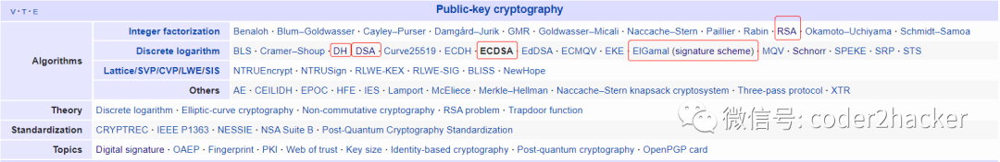
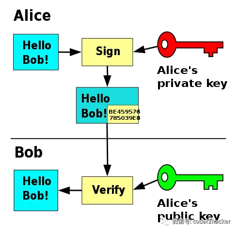
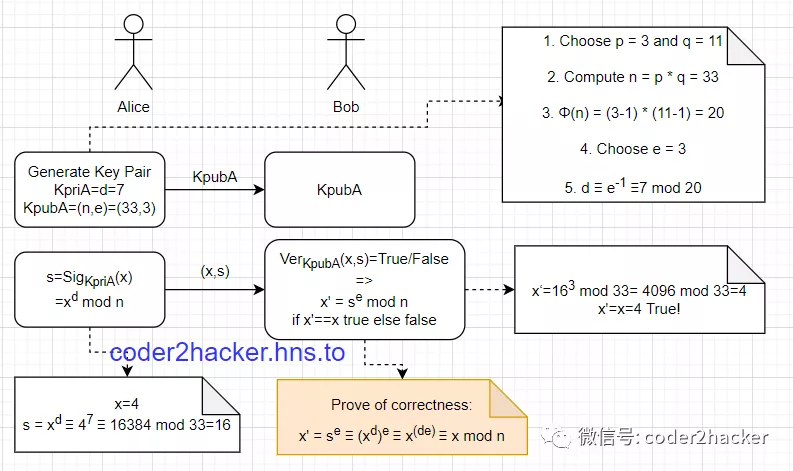
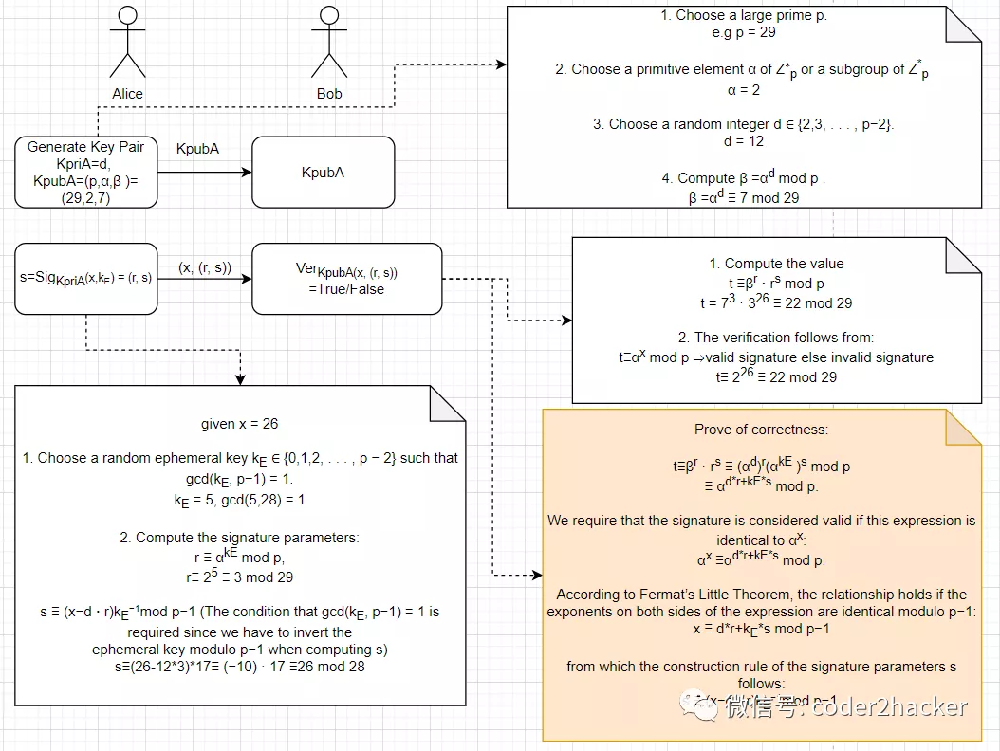
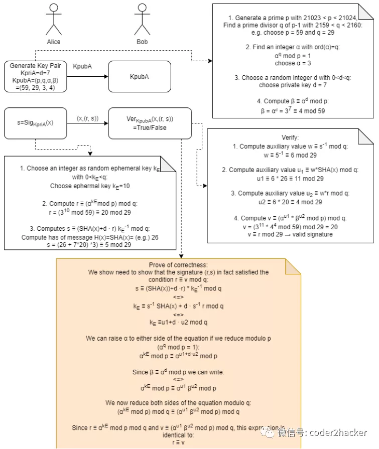
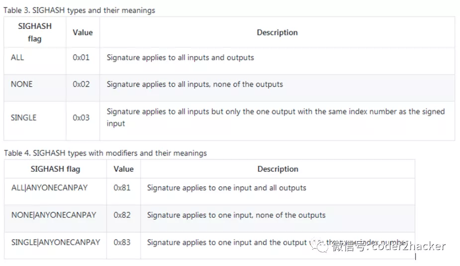
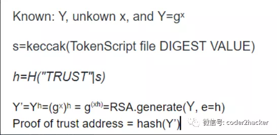

随着逐渐深入，可能大家注意到我之前“漏掉”了一个关键的知识链条，就是 签名Signature 的生成，签名的目的是证明你拥有该私钥，普通软件中签名是证明你是该信息或文档的拥有者，而对于不比特币来说，签名是证明你是这笔资金的拥有者，即你有权限使用该私钥控制的资金,

所以我现在有必要对比特币用到的椭圆曲线函数 ecc以及相应的签名算法 ecdsa 展开讲解，同时我会讲解一个实例，就是应alphawallet CTO 张韡武学长的邀请开发的一个小工具：[express of trust address](https://github.com/lyhistory/TokenScriptTool)

## Digital Signature

数字签名,又称公钥数字签名,是一种用于验证数字消息或文档的真实性的数学方案,具体来说是对消息或者文档的digest摘要进行签名计算生成的数字，有效的数字签名具有以下属性 ：

+ 完整性 integrity

    保证该消息在传输过程中没有发生更改，简单的说就是如果消息被更改，则签名失效；

    对于比较长的消息或大的文档来说，通常需要对其先进行压缩 通常是进行**哈希方法 Hash Function**获取哈希值作为可以代表该消息或文档的message digest又称为指纹 fingerprint  ，然后对哈希值进行签名，这里选用的哈希函数需要具备以下属性：
    - Arbitrary message size h(x) can be applied to messages x of any size.
    - Fixed output length h(x) produces a hash value z of fixed length.
    - Efficiency h(x) is relatively easy to compute.
    - 抗原像性 Preimage resistance：对于给定的输出z，不可能找到任何输入x使得h（x）= z，即h（x）是单向的计算。
    
    例子：Bob发送签名消息给Alice：
    kpr,B=d, kpub,B=e
    (ek(x), sigkpr,B(z)).
    ek是双方的对称加密如AES密钥，然后Bob使用RSA进行签名，s=sigkpr,B(z)) ≡ zd mod n，任何人都可以通过Bob的公钥计算出哈希值 se ≡ z mod n.，如果hash function不是单向的，则任何人都可以反向计算出对应的消息x h−1(z) = x.从而就绕过了双方的对称加密

    - 抗第二原像性 Second preimage resistance：给定x1，因此给定h（x1），通过计算找到任何x2使得h（x1）= h（x2）是不可行的。
    根据pigeonhole principle或Dirichlet’s drawer principle这是不可能的，所以只能退而求其次我们要尽可能保证实践中无法构造出x2，意味着不存在analytical attack，至于避免爆破攻击（exhaustive brute force）我们可以增加哈希方法输出的长度。

    - 耐碰撞性 Collision resistance：通过计算找到任何一对值 x1≠x2使得h（x1）= h（x2）是不可行的（跟前面不同，这里是任意x1 x2而不是给定x1）

    除此之外，特别对于签名的有效性来说，还需要具备另外一个属性：找不到有效可行的方法来修改信息或哈希摘要以及签名，并且让修改后的新签名变成新消息的有效签名

+ 真实性 authenticity

    某个签名必须只能是对应的私钥持有者签的名，所以通过签名可以认定其身份，使接收者非常有理由相信该消息是由已知的发件人创建的；

    反例：对称加密算法就不适用于签名，因为大家持有的是一样的密钥

+ 不可否认性 Non-repudiation

    已对某些信息进行签名的有关方不能否认自己做过这个签名，当然其他人也不能仅通过访问公钥来伪造有效签名；

虽然不能篡改签名，但很多digital signature 算法都不能免疫于 forgery/replay attack 伪造攻击，因为当Alice做了足够的多的签名，黑客Craig可以从从选择某个签名和信息对，作为中间人replay发给Bob，所以签名只是一方面，整个程序的安全性还需要建立在整体的设计上，比如比特币就不会受到forgery attack的影响，如果受影响就相当于出现double spend，而这个正是比特币的设计所避免的。

### Note: 关于哈希 Hash Function和MAC-message authentication codes
哈希方法 Hash Function是不带key的/keyless，常用于最重要的两个应用：
数字签名 和 MAC-message authentication codes，

digital signature VS Hmac

| - | Hash | MAC(keyed hash function) | Digital signature |
| --- | --- | --- | --- | 
| Integrity | Yes | Yes | Yes |
| Authentication | No | Yes | Yes |
| Non-repudiation | No | No | Yes |
| Kind of keys | None | Symmetric | Asymmetric |

The three security requirements for hash functions are one-wayness, second
preimage resistance and collision resistance.
Hash functions should have at least 160-bit output length in order to withstand
collision attacks; 256 bit or more is desirable for long-term security.
MD5, which was widely used, is insecure. Serious security weaknesses have
been found in SHA-1, and the hash function should be phased out. The SHA-
2 algorithms all appear to be secure.
The ongoing SHA-3 competition will result in new standardized hash functions
in a few years.
哈希方法length extension attack 长度延展攻击
像md5 sha1等基于 Merkle–Damgård construction 的哈希算法并不安全，
由此构造的MAC=》BadMAC(secret,message)= H(secret ‖ message)  is the concatenation of the Key and the Message.容易受到 length extension attack 长度延展攻击：
https://en.wikipedia.org/wiki/Length_extension_attack
https://www.bilibili.com/video/BV1uy4y1h7Qr/
https://crypto.stackexchange.com/questions/3978/understanding-the-length-extension-attack

安全的MAC实现：HMAC

## RSA Signature

公钥加密，私钥解密反过来就是RSA的签名算法即：

私钥加密，公钥验证

P.S. 有意思的是RSA后两个字母刚好跟 Signatrue Algorithm缩写一样，但实际上是 Rivest–Shamir–Adleman 三位大佬姓氏的缩写

RSA安全性是基于大素数分解问题 Large Prime factorization

## Elgamal Digital Signature

Elgamal signature

其安全性是基于离散对数问题 discrete logarithms

## DSA - Digital Service Standards

正如其名字本身数字签名算法，这是由美国国家标准学会提议与技术National Institute of Standards and Technology （NIST）基于Elgamal signature scheme 提出的美国联邦政府数字标准签名Digital Service Standards (DSS)

签名只有320位，但是签名验证比RSA慢，因为是基于Elgamal signature scheme 所以其安全性也是基于离散对数问题 discrete logarithms

## ECDSA - Elliptic Curve Digital Signature Algorithm

ECDSA secp256k1 

keccak

secp256k1's elliptic curve y2 = x3 + ax+b (a=0,b=7) over the real numbers:
the graph is

secp256k1 is actually defined over the field:
y2 = x3+ax+b over Fp
graph will in reality look like random scattered points...

ECC位长度在160–256位的范围内, 其安全性与1024–3072位的RSA和DL相同，更短的位长，处理时间越短，并且签名也短，由于这些原因，1998年椭圆曲线数字签名算法（ECDSA）被ANSI 美国国家标准研究所进行了标准化。

ECDSA的构建步骤跟DSA很接近，但是其离散对数问题是构造在基于素数域Zp或者是伽罗华域 Galois fields GF(2^m) 的椭圆曲线上，所以在实际计算过程上完全跟DSA不同。

https://hackernoon.com/hacking-a-bitcoin-wallet-642u36sa

https://github.com/bitcoinbook/bitcoinbook/blob/db678d15c08e7be4180ba9e9fbc60ee004eb5c3c/ch06.asciidoc

Sig = Fsig(Fhash(m),dA)

dA is the signing private key

m is the transaction

Fhash is the hashing function

Fsig is the signing algorithm

Sig is the resulting signature

The signing function (Fsig) produces a signature (Sig) that comprises of two values: R and S:

Sig = (R, S)

Once R and S have been calculated, they are serialized into a byte stream that is encoded using an international standard encoding scheme that is known as the Distinguished Encoding Rules (or DER). In order to verify that the signature is valid, a signature verification algorithm is used. Verification of a digital signature requires the following:

Signature (R and S)

Transaction hash

The public key that corresponds to the private key that was used to create the signature

Verification of a signature effectively means that only the owner of the private key (that generated the public key) could have produced the signature on the transaction. The signature verification algorithm will return ‘TRUE’ if the signature is indeed valid.

Sig = (R, S, SIGHASH) R and S are serialized into a byte-stream using an international standard encoding scheme called the Distinguished Encoding Rules, or DER. Signature Hash Types (SIGHASH): - ALL - NONE - SINGLE - ANYONECANPAY

ECDSA Math AND The Importance of Randomness in Signatures If the same value k is used in the signing algorithm on two different transactions, the private key can be calculated and exposed to the world! To avoid this vulnerability, the industry best practice is to not generate k with a random-number generator seeded with entropy, but instead to use a deterministic-random process seeded with the transaction data itself. This ensures that each transaction produces a different k. The industry-standard algorithm for deterministic initialization of k is defined in RFC 6979, published by the Internet Engineering Task Force

## Express of Trust address

理论:

https://mail.google.com/mail/u/0/#search/TokenScriptTool/FMfcgxwCgzFSrzCzLpxqwZrtPznWswpj

https://github.com/TokenScript/TokenScript/blob/main/doc/authenticity+trustworthiness.md

工具：https://github.com/lyhistory/TokenScriptTool

https://community.tokenscript.org/t/demo-tool-for-express-of-trust/235

https://github.com/lyhistory/TokenScriptTool/releases/tag/0.0.1

https://github.com/TokenScript/TokenScript/pull/193

Produce a command line tool which
    Taking a TokenScript file for input, and provide the proof-of-trust

    address and the proof-of-revoke address for that TokenScript.

First, how do you get the digest of a TokenScript?

     Here is a short instruction:

     - Assume you already have xmlsectool installed.

     - Clone the TokenScript project https://github.com/AlphaWallet/TokenScript

     - Enter directory examples/nft

     - Observe the unsigned TokenScript EntryToken.xml

     - Sign it. (try to run Make and follow the instructions)

     - Observe the signed TokenScript EntryToken.tsml and notice the value in

     <DigestValue>

Now, notice that the DigestValue is obtained with xmlsectool, you should

     be able to study the source code of xmlsectool and manage to get a

     DigestValue for any TokenScript file.

     If you have a problem getting the DigestValue, Sangalli knows the answer.

Second, how do you get the proof-of-trust address and proof-of-revoke

address?

     security.md document is exactly what you need.

     If you have a problem understanding that, Tore knows the answer.

I believe you will need to ask some questions to Sangalli regarding

getting the DigestValue or ask Tore regarding getting proof-of-trust

address. Please register an account on tokenscript.org and ask

there. It's better than asking by email since others might seek this

knoweldge. Sangalli will make sure someone attends your

questions. e.g. he will whisle Tore if the issue about him goes

un-answered.

You can also join us for a design meeting next Thursday's weekly

meeting at 7 pm Sydney time in which Tore will show up.

hi, 

sorry a little bit busy yesterday, today I just got time go through the info you mentioned, and still got some questions need your clarification.

below is the step I finalized from my current understanding, 

so the purpose of the tool is to generate proof of trust address:

question 1: where to use digest value of Tokenscript, is it to get the s = keccak(digest value of the tokenscript file)

question 2: my cryptographic basis knowledge is not strong enough, it took me some time to recall the basic, is here Y=gˣ using RSA, at first I thought it's ecc, but ecc is scala multiplicative, something like Y=nG, but if it's RSA, we can't get eth address from RSA key, I'm confused refer to statements in Security.md " Assume that TokenScript project's donation address' public key is known, which is Y. In multiplicative group notation, its value is gˣ where 𝑥 is the private key held by TokenScript administration. " 

I understand that you might be concerned that there are math

expressions in your question so you weren't sure if they would be

displayed correctly if you post to TokenScript.org

Here is the key math expression I typed for you, which you can copy

and paste to the forum.

   Y' = Yʰ = (𝑔ˣ)ʰ = 𝑔ˣʰ = RSA.generate(Y, 𝑒=ℎ)
When you post, be specific about the problem (to get the

express-of-trust address by following the guide on the document):

https://github.com/AlphaWallet/TokenScript/blob/master/doc/security.md

Regards

(I would share my math keyboard layout with you but they are for Linux)

## Authenticity and trustworthiness of a TokenScript

(This document is not about the runtime security of Token Enclave - which will be documented separately. This deals with the authenticity and trustworthiness of a TokenScript on a textual level.)

A TokenScript file can be signed. A TokenScript can also be trusted. Ideally, both should be done.

At the moment, TokenScript is trusted through an "Express-of-Trust" transaction from the smart contract deployment key. In the future, a smart contract might be able to return the signing key needed for TokenScript. Both should work towards asserting the relationship between a Smart Contract and a TokenScript, hence establishing trust.

However, trust coming from smart contract alone isn't sufficient to the end user, since the user has otherwise no way to assert if the smart contract is the one he intends to interact with, or a phishing contract. But when that trust is not available, having the TokenScript signed helps the end-user to ascribe trust by authenticity.

- If a TokenScript is trusted, through an Express-of-Trust transaction, then the Smart Contract owner has either created or read the TokenScript and recommended the end-users to use it.

- If a TokenScript is signed, the end-user can ascribe authenticity (the author and integrity), and if that author is known to the end-user, he is likely to trust it without the Express-of-Trust; otherwise, he makes his own decision.

Or in other words:

- signing a TokenScript establish authenticity of the TokenScript but not how much the token contract trusts it;

- the express-of-trust transaction expresses that the token contract author trusts the TokenScript, but nothing about authenticity (who wrote it).

Or in layman's terms:

- Signing a TokenScript "connects" it to identity (e.g. a website, an organisation), with no guarantee if that identity is of a trustworthy entity.

- Express-of-trust claims the  TokenScript trustworthy, without connecting it to any identity.

Both have their uses. If you are a token contract author, you can do express-of-trust to a TokenScript; however, there are cases that signed TokenScripts are needed:

Case 1:

A token issuer (custodian) want to reassure a user who trusts it by an external (non-blockchain) identity (e.g. website domain name) that he/she is using the correct contract. For example, a token issuer changed its main contract after discovering some security exploitation. It knows that its user trust it by domain name, so it might issue a token script that is signed by the same domain name with expressed trust from both the old and new contract to help the user to migrate.

Case 2:

A token issuer discarded his deployment key (or lost it), but still wish to let its user trust the TokenScript they provided by the help of providing authenticity (revealing the authorship).

Case 3:

A token issuer did not write a TokenScript, but a 3rd party did it; or that the 3rd party has provided additional features. If the 3rd party gained trust (e.g. through social media or within a community), it can sign and release its own TokenScript, and the users can accept them by the reputation of the 3rd part without the token contract's Express-of-Trust.

(The cases of "mixed configuration", like when a 3rd party writes a TokenScript providing action in addition to the one written by the token issuer, is not covered in this introductory document. Instead, they are covered in the future modularisation documents.)

## Signed

A signed TokenScript file is a TokenScript file signed through the use of an XML Signature. Any signature signing algorithm supported by XML Signature (including ECDSA supported through XML Signature 1.1) is accepted.

At this moment, user agents should only accept such XML Signatures if certified by a certificate authority (CA). For convenience, a website certificate will do at this moment. In the years to come, implementations might require certificates from issuers who can validate an organisation or various forms of decentralised certificate issuers.

When a signed TokenScript is used, the user agent displays the domain name or organisation name of the certificate. It's up to the user if they allow the use of such a TokenScript. We expect users to assert judgement based on whether or not they recognise the CommonName of the certificate.

Revocation follows the same principles as these certificates normally do.

### Signing of external data

Any data reference - icons, images and language packs - used by the TokenScript must be referred to in the `<SignedInfo>` section of the XML signature using `<Reference>` element, or they will be considered not available (TokenScript implementations decide how to treat unavailable data). Each reference is downloaded and its digest verified as part of the TokenScript signature verification process. If any of the references fail to download or the digest doesn't match, the entire XML signature is bad. 

## Trusted (Ethereum)

A trusted TokenScript file is one explicitly trusted by the author of a token contract on Ethereum. Such trust is expressed by an Ethereum transaction. Only one signing algorithm, ECDSA (secp256k1), is used in express-of-trust because trust is expressed by an Ethereum transaction.

Such trust is also revoked by a transaction.

The transaction consists of a simple To address, with no data attached.

### The "from" address

If the smart contract has no key-management on its own, the transaction should be sent from the smart contracts deployment key. If the smart contract has a key management function, the transaction should be sent from the current administrative key.

### The "to" address

- to express trust, send any amount (e.g. 0Ξ) to a special address that represents the trust from the token contract (𝑡) to the TokenScript.

- to express revocation, send any amount (e.g. 0Ξ) to another special address that represents the revocation of such trust.

The express-of-trust special address is calculated in this way:

TokenScript project's donation address is: `0x000bd52fb4f46f148b0ff0cc651048e283d2d000`. Its public key is *Y*, its value is:

0x483d69cc4377d318da81402f2488f588ccae3d22a37be36457a574487d9ca4d9c38cd62d83113e440c7bdc682ced6d05ee739b831c6d5cb01982367f76fc8ce0

In multiplicative group notation, its value is 𝑔ˣ where 𝑥 is the private key held by TokenScript administration.

First, we obtain a SHA256 digest 𝑑 from the exclusive canonicalization of the TokenScript. If this TokenScript happens to be signed as well, and the `<DigestMethod>` used for its root is SHA256 (it usually is), you can find the value encoded in base64 in the `<DigestValue>` if it is signed. (Of course, you need to calculate this value if the TokenScript isn't signed.)

Then compute *h=H(𝑡|"TRUST"|𝑑)* where *H* denotes Keccak. `|` is used to denote concatenation. The text *TRUST* is simply an ASCII encoding of the literal word TRUST.

Then, we generate the secp256k1 elliptic curve point Yʰ, and hash it to get an address. This is the special address for express-of-trust of this specific TokenScript.

This address can be independently generated by TokenScript implementations, without the knowledge of 𝑥. Hence trust can be verified independently. In the meanwhile, if an implementation has the TokenScript file, it can calculate the private key of that address by 𝑥·ℎ given that (𝑔ˣ)ʰ = (gʰ)ˣ.

For revocation, the idea is the same, except the point used for the special address is now *h=H(𝑡|"REVOKE"|s)*. 

## difference between trusted and signed

### Symantec: signing express authorship, not trust

A signed TokenScript is no more trustworthy than the signer identified by CommonName. It has no cryptographically provable tie to the token itself. For example, we know by reputation that MakerDAO has the stewardship of the DAI token, so a TokenScript for DAI Token signed by MakerDAO.com is probably trustworthy.

In other words, whether or not a signed TokenScript is trustworthy is the judgement of the user.

Express-of-trust is stronger and more direct. The key holder which deployed (or manages) the DAI token contract explicitly expressed trust to that TokenScript by sending a transaction. It's time locked in a blockchain.

It's worth noticing that Express-of-trust isn't authorship - a smart contract author can express trust to a signed TokenScript authored by someone else. While signed a TokenScript implies authorship. 

### Signing isn't on the file; trust is

A signed TokenScript is signed by an XML signature which usually is (but not required to) be embedded in an XML file. The cryptographic signature is not in the file; it's in the `<SignedInfo>` element of the XML Signature. The XML signature is not in the file either, it's on a collection of references which typically contains the root node of the TokenScript.

### Signing doesn't use Keccak at all; express of trust only uses Keccak

Keccak isn't defined as a valid hashing method in XMLSIG11, so it can't be used in an XML Signature without extending the w3 recommendation behind it, which leads to trouble when validating with existing tools. Therefore we restrict the signing of TokenScript to the algorithms allowed in XMLSIG11.

For the same reason, since developers might be habitually using Keccak in blockchain applications, we use Keccak to hash the TokenScript as well as the express-of-trust.

参考资料:

https://lyhistory.com/docs/blockchain/btc/btc_dev.html#_3-5-transactions

https://lyhistory.com/docs/software/highlevel/publickey_infrastructure.html

