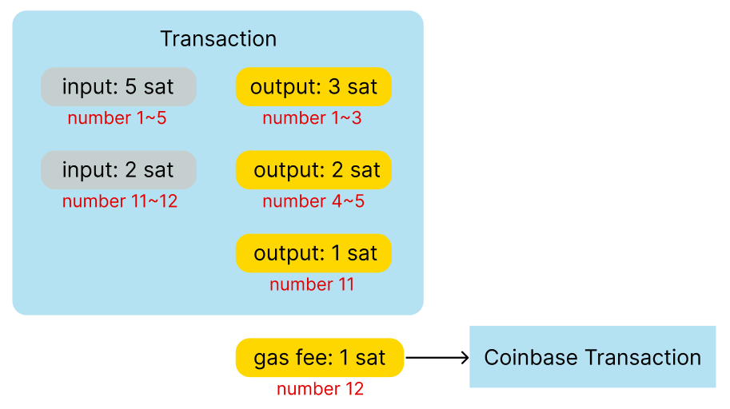

[docs.ordinals.com](https://docs.ordinals.com/)

https://en.foresightnews.pro/unveiling-the-mysteries-of-ordinal-inscriptions-a-comprehensive-and-in-depth-popular-science-interpretation/

ZK-proofs 是比特币序数和 BRC-20 问题的答案吗 https://zhuanlan.zhihu.com/p/629604259

## 市场
https://www.okx.com/web3/marketplace/ordinals/brc20/satx

https://satsx.io/wallet/ordinals

## Ordinal Theory
A satoshi is the smallest unit of the Bitcoin currency. 1 BTC is equal to 100 million satoshis. Ordinal theory describes how to label every satoshi with a unique number. The total supply of Bitcoin is 2,100,000,000,000,000 satoshis—which are numbered in the order in which they’re mined. When a new block is mined out, there are some new satoshis with new unique numbers in the coinbase transaction, so every satoshi can have its owner.

Satoshis only live in UTXO. When transactions destroy inputs and create new ones in outputs, satoshis transfer in a first-in-first-out order by Ordinal theory. In the following example, there are two inputs with 5 sats, which are labeled 1 to 5, and 2 sats which are labeled 11 to 12. To assign satoshi numbers to UTXO, go through each satoshi in the inputs in order (1-5 and then 11-12), and assign each to the first available slot in the outputs, which are 1-3, 4-5 and 11. The number 12 doesn’t disappear, it’s just the gas fee that’s sent to the coinbase transaction. You can check out [the whole algorithm here](https://github.com/casey/ord/blob/master/bip.mediawiki#specification).

Ordinal theory virtually converts these fungible token satoshis into non-fungible tokens. Next, we’re going to introduce a way to write something into the witness field(segwit taproot) of one satoshi.

Given a real-world example: 
[commit(应该是mint出brc token的交易)](https://www.blockchain.com/explorer/transactions/btc/474604ceb83691eb44e862d1aaacef61c6b00435fde34f3cc53b74554094ab21) and [reveal(用户花费该交易的时候)](https://www.blockchain.com/explorer/transactions/btc/518d049cf9df009daa943d90b5c21905e682f8e37a4b7a84dfc0f8349b53f045). At the commit stage, the transaction created two P2TR outputs and the first one is what we need to see. Then at the reveal stage, the Ordinals inscription is able to be found in the witness field.

[Dive into How Bitcoin Ordinals NFTs Work](https://blocto.io/crypto-blog/ecosystem/how-bitcoin-ordinals-nfts-work)