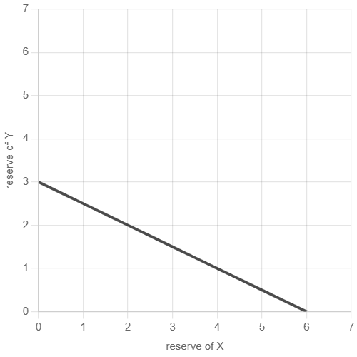
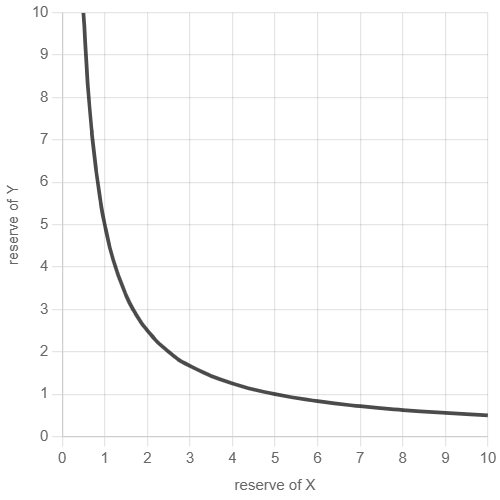

## Introduction
The best way to learn something is to teach others. Second best way to learn something is to do it yourself. I decided to combine the two ways and teach myself and you how to program DeFi services on Ethereum (and any other blockchains based on EVM – Ethereum Virtual Machine).

Our main focus will be on how those services work, we’ll try to understand the economical mechanics that make them what they are (and they all based on economical mechanics). We’ll find out, decompose, learn, and build their core mechanisms.

However, we’ll only work on smart contracts: building front-end for smart-contracts is also a big and interesting task, but it’s out of the scope of this series.

Let’s begin our journey with Uniswap.

[You can find full source codes in this repo](https://github.com/lyhistory/learn_web3_uniswapv1/tree/part_1)
## DEX

Most of us are used to buying crypto through centralized exchanges - Binance, Coinbase, etc. Often times, we resolve to the same platforms when trading between different cryptocurrencies. However, centralized exchanges are rife with problems. They can get hacked and lose all their user's money, or worse yet, the company behind the exchange can close up shop and run away with all the money. This may seem extreme, but this is not fiction.

The idea of a decentralized exchange is simple - allow users to trade their crypto directly on-chain through smart contracts without giving up control of their private keys.

While it sounds simple, the reality is much more complicated. In short, decentralized exchanges are a beautiful piece of mathematics and software combined together. We hope by the end of this article you will share the same feeling.

The birth of modern decentralized exchanges was primarily led by Uniswap. Not only is Uniswap the leading decentralized exchange on Ethereum, it is THE leading dApp on Ethereum in general.

After Vitalik Buterin posted a blog post on Path Independence in 2017, Hayden Adams was inspired to try to implement Vitalik's ideas in what eventually became Uniswap. After spending over a year working on the code, Hayden finally announced and launched Uniswap v1 in November 2018. You can read more about the history of Uniswap in this blog post by the founder.

You might be wondering - "why can't we just recreate a centralized exchange on-chain?" Well, you can, but it's not good enough.

Centralized exchanges typically work on an order-book system. Alice puts up a listing saying she is willing to sell 100 of 'TokenA' for 50 of 'TokenB', and the listing is added to the order book. At some point, if Bob comes along and says he wants to buy 100 of 'TokenA' for 50 of 'TokenB' - their orders are matched together, and the trade is executed.

Order-book based exchanges were attempted on Ethereum, with the most significant example being 0xProject but due to the high gas required for all the storage and matching algorithms, it was challenging to attract users.

There was need for a new approach, a way to allow users to swap between any two tokens arbitrarily without needing an orderbook. Additionally, cookie points if users could actually earn money by using Uniswap.

Uniswap is an Automated Market Maker - an AMM. Let's try to break down what that means.

Market Makers are entities that provide liquidity (assets) to trading markets. In non-orderbook systems, liquidity is what allows trading to be possible. That means if you want to sell BTC to buy ETH, the exchange must have an ETH balance you can purchase from in exchange for BTC. Some trading pairs have very high liquidity (eg. BTC/ETH trading pair), but some have extremely low or no liquidity at all (eg. scam tokens, or newly created tokens).

A DEX must have enough liquidity to function and serve as an alternative to centralized exchanges.

One way to get that liquidity is that the developers (or investors) put in their own money and become market makers. However, this is not realistic as they would need a huge amount of money to provide enough liquidity for all possible trading pairs. Moreover, this hurts decentralization, as the developers/investors would hold all the power in the market.

Another way, which Uniswap implemented, was to let anyone be a market maker - and this is what makes Uniswap an automated market maker. Any user can deposit funds to a specific trading pair and add liquidity, and in exchange earn money for doing so through trading fees taken from the users.

## Uniswap v1, v2, v3, and now v4
The first version, Uniswap v1, was launched in November 2018 and allowed swaps between ETH and an ERC-20 Token. Chained swaps were also possible to allow for Token <> Token swaps such as going from Token A <> Token B by first converting one of them to ETH, and then using that ETH to buy the other one.

Uniswap v2 came out in March 2020 and was a huge improvement over v1 that allowed direct swaps between any two ERC-20 tokens, as well as chained swaps between any pairs if a direct swap was not possible.

Uniswap v3 came out in May 2021 and improved capital efficiency, which allowed liquidity providers to remove a bigger portion of their liquidity from pools and still keep getting the same rewards.

Uniswap v4 came out in June 2023 and allowed for custom hooks to be added to pools, and also a singleton Uniswap contract to manage all pools on the DEX thereby reducing gas costs and allowing more customizability of the different pools.

## Functional Requirements

Considering what we have learnt, we need to allow for the following functionality at least to build an automated market maker:

Anyone can add liquidity to become a liquidity provider (LP)

Liquidity providers can remove their liquidity and get back their crypto whenever they want

Users can swap between assets present in the trading pools, assuming there is enough liquidity

Users are charged a small trading fees, that gets distributed amongst the liquidity providers so they can earn for providing liquidity

At the core of Uniswap v1 is one math equation: x * y = k. 

Let's go through it's working with an example. Assume we have a trading pair for ETH <> TOKEN.  Then,

x: The balance of ETH in the trading pool

y: The balance of TOKEN in the trading pool

k: A constant value

It doesn't matter if we use x to represent the balance of ETH or the balance of TOKEN in the trading pool, as long as y represents the opposite

Uniswap requires that k remains the same no matter how much of reserves of x or y there are. When you trade ether for tokens you deposit your ethers into the contract and get some amount of tokens in return. Uniswap ensures that after each trade k remains the same (this is not really true, we’ll see later why).

This formula is also responsible for pricing calculations, and we’ll soon see how.

## Uniswap V1 Smart contracts development
To really understand how Uniswap works we’ll build a copy of it. We’ll write smart contracts in Solidity and will use HardHat as our development environment. HardHat is a really nice tool that greatly simplifies development, testing, and deployment of smart contracts. Highly recommended!

If you’re new to smart contracts development, I highly recommend you to finish [this course](https://cryptozombies.io/en/course/) (at least the basic path) – that’ll be a huge help to you!

### Setting up the project
First, create an empty directory (I called mine zuniswap), cd into it and install HardHat:
```
$ mkdir zuniswap && cd $_
$ yarn add -D hardhat
```
We’ll also need a token contract, let’s use ERC20 contracts provided by OpenZeppelin.
```
$ yarn add -D @openzeppelin/contracts
```

Initialize a HardHat project and remove everything from contract, script, and test folders.
```
$ yarn hardhat
...follow the instructions...
$ rm ...
$ tree -a
.
├── .gitignore
├── contracts
├── hardhat.config.js
├── scripts
└── test
```
Final touch: we’ll use the latest version of Solidity, which is 0.8.4 at the time of writing . Open your hardhat.config.js and update Solidity version at the bottom of it.

### Token contract
Uniswap V1 supports only ether-token swaps. To make them possible we need an ERC20 token contract. Let’s write it!
```
// contracts/Token.sol
pragma solidity ^0.8.0;

import "@openzeppelin/contracts/token/ERC20/ERC20.sol";

contract Token is ERC20 {
  constructor(
    string memory name,
    string memory symbol,
    uint256 initialSupply
  ) ERC20(name, symbol) {
    _mint(msg.sender, initialSupply);
  }
}
```
This is all we need: we’re extending the ERC20 contract provided by OpenZeppelin and defining our own constructor that allows us to set token name, symbol, and initial supply. The constructor also mints initialSupply of tokens and sends them to token creator’s address.

Now, the most interesting part begins!

### Exchange contract
Uniswap V1 has only two contracts: Factory and Exchange.

Factory is a registry contract that allows to create exchanges and keeps track of all deployed exchanges, allowing to find exchange address by token address and vice versa. Exchange contract actually defines exchanging logic. Each pair (eth-token) is deployed as an exchange contract and allows to exchange ether to/from only one token.

We’ll build Exchange contract and leave Factory to a later blog post.

Let’s create a new blank contract:
```
// contracts/Exchange.sol
pragma solidity ^0.8.0;

contract Exchange {}
```
Since every exchange allows swaps with only one token, we need to connect Exchange with a token address:
```
contract Exchange {
  address public tokenAddress;

  constructor(address _token) {
    require(_token != address(0), "invalid token address");

    tokenAddress = _token;
  }
}
```
Token address is a state variable which makes it accessible from any other contract function. Making it public allows users and developers to read it and to find out what token this exchange is linked to. In the constructor, we’re checking that provided token is valid (not the zero address) and save it to the state variable.

### Providing liquidity
As we have already learned, liquidity makes trades possible. Thus, we need a way to add liquidity to the exchange contract:

```
import "@openzeppelin/contracts/token/ERC20/IERC20.sol";

contract Exchange {
    ...

    function addLiquidity(uint256 _tokenAmount) public payable {
        IERC20 token = IERC20(tokenAddress);
        token.transferFrom(msg.sender, address(this), _tokenAmount);
    }
}
```

By default, contracts cannot receive ethers, which can be fixed via the payable modifier that enables ethers receiving in a function: any ethers sent along with a function call are added to contract’s balance.

Depositing tokens is a different thing: since token balances are stored on token contracts, we have to use transferFrom function (as defined by the ERC20 standard) to transfer tokens from transaction sender’s address to the contract. Also, transaction sender would have to call approve function on the token contract to allow our exchange contract to get their tokens.

This implementation of addLiquidity is not complete. I intentionally made it so to focus more on pricing functions. We’ll fill the gap in a later part.

Let’s also add a helper function that returns token balance of an exchange:

```
function getReserve() public view returns (uint256) {
  return IERC20(tokenAddress).balanceOf(address(this));
}
```

And we can now test addLiquidity to ensure everything’s correct:
```
describe("addLiquidity", async () => {
  it("adds liquidity", async () => {
    await token.approve(exchange.address, toWei(200));
    await exchange.addLiquidity(toWei(200), { value: toWei(100) });

    expect(await getBalance(exchange.address)).to.equal(toWei(100));
    expect(await exchange.getReserve()).to.equal(toWei(200));
  });
});
```
First, we let the exchange contract spend 200 of our tokens by calling approve. Then, we call addLiquidity to deposit 200 tokens (the exchange contract calls transferFrom to get them) and 100 ethers, which are sent along with the function call. We then ensure that the exchange did in fact receive them.

### Pricing function
Now, lets think about how we would calculate exchange prices.

It might be tempting to think that price is simply a relation of reserves, e.g.:
Px=y/x,Py=x/y

And this makes sense: exchange contracts don’t interact with centralized exchanges or any other external price oracle, so they cannot know the right price. In fact, exchange contract is a price oracle. Everything they know is ether and token reserves, and this is the only information we have to calculate prices.

Let’s stick to this idea and build a pricing function:
```
function getPrice(uint256 inputReserve, uint256 outputReserve)
  public
  pure
  returns (uint256)
{
  require(inputReserve > 0 && outputReserve > 0, "invalid reserves");

  return inputReserve / outputReserve;
}
```
And let’s test it:
```
describe("getPrice", async () => {
  it("returns correct prices", async () => {
    await token.approve(exchange.address, toWei(2000));
    await exchange.addLiquidity(toWei(2000), { value: toWei(1000) });

    const tokenReserve = await exchange.getReserve();
    const etherReserve = await getBalance(exchange.address);

    // ETH per token
    expect(
      (await exchange.getPrice(etherReserve, tokenReserve)).toString()
    ).to.eq("0.5");

    // token per ETH
    expect(await exchange.getPrice(tokenReserve, etherReserve)).to.eq(2);
  });
});
```
We deposited 2000 tokens and 1000 ethers and we’re expecting the price of token to be 0.5 ethers and the price of ether to be 2 tokens. However, the test fails: it says we’re getting 0 ethers in exchange for our tokens. Why is that?

The reason is that Solidity supports integer division with only floor rounding. The price of 0.5 gets rounded to 0! Let’s fix that by increasing the precision:
```
function getPrice(uint256 inputReserve, uint256 outputReserve)
  public
  pure
  returns (uint256)
{
    ...

  return (inputReserve * 1000) / outputReserve;
}
```

After updating the test, it’ll pass:
```
// ETH per token
expect(await exchange.getPrice(etherReserve, tokenReserve)).to.eq(500);

// token per ETH
expect(await exchange.getPrice(tokenReserve, etherReserve)).to.eq(2000);
```
So, now 1 token equals to 0.5 ethers and 1 ether equals to 2 tokens.

Everything looks correct but what will happen if we swap 2000 tokens for ether? We’ll get 1000 ethers and this is everything we have on the contract! The exchange would be drained!

Apparently, something is wrong with the pricing function: it allows to drain an exchange, and this is not something we want to happen.

The reason of that is that the pricing function belongs to a constant sum formula, which defines k as a constant sum of x and y. The function of this constant sum formula is a straight line:


It crosses x and y axes, which means it allows 0 in any of them! We definitely don’t want that.

### Correct pricing function
Let’s recall that Uniswap is a constant product market maker, which means it’s based on a constant product formula:
x*y=k

Does this formula produce a better pricing function? Let’s see.

The formula states that k remains constant no matter what reserves (x and y) are. Every trade increases a reserve of either ether or token and decreases a reserve of either token or ether – let’s put that logic in a formula:
(x+Δx)(y−Δy)=xy

Where Δx is the amount of ethers or tokens we’re trading for Δy, amount of tokens or ethers we’re getting in exchange. Having this formula we can now find Δy:
Δy=yΔx/(x+Δx)

This looks interesting: the function now respects input amount. Let’s try to program it, but note that we’re now dealing with amounts, not prices.

```
function getAmount(
  uint256 inputAmount,
  uint256 inputReserve,
  uint256 outputReserve
) private pure returns (uint256) {
  require(inputReserve > 0 && outputReserve > 0, "invalid reserves");

  return (inputAmount * outputReserve) / (inputReserve + inputAmount);
}
```
This is a low-level function, so let it be private. Let’s make two high-level wrapper functions to simplify calculations:
```
function getTokenAmount(uint256 _ethSold) public view returns (uint256) {
  require(_ethSold > 0, "ethSold is too small");

  uint256 tokenReserve = getReserve();

  return getAmount(_ethSold, address(this).balance, tokenReserve);
}

function getEthAmount(uint256 _tokenSold) public view returns (uint256) {
  require(_tokenSold > 0, "tokenSold is too small");

  uint256 tokenReserve = getReserve();

  return getAmount(_tokenSold, tokenReserve, address(this).balance);
}
```
And test them:
```
describe("getTokenAmount", async () => {
  it("returns correct token amount", async () => {
    ... addLiquidity ...

    let tokensOut = await exchange.getTokenAmount(toWei(1));
    expect(fromWei(tokensOut)).to.equal("1.998001998001998001");
  });
});

describe("getEthAmount", async () => {
  it("returns correct eth amount", async () => {
    ... addLiquidity ...

    let ethOut = await exchange.getEthAmount(toWei(2));
    expect(fromWei(ethOut)).to.equal("0.999000999000999");
  });
});
```

So, now we’re getting 1.998 tokens for 1 ether and 0.999 ether for 2 tokens. Those amounts are very close to the ones produced by the previous pricing function. However, they’re slightly smaller. Why is that?

The constant product formula we based our prices calculations on is, in fact, a hyperbola:



Hyperbola never crosses x or y, thus neither of the reserves is ever 0. This makes reserves infinite!

And there’s another interesting implication: the price function causes price slippage. The bigger the amount of tokens traded in relative to reserves, the higher the price would be.

This is what we saw in the tests: we got slightly less than we expected. This might be seemed as a drawback of constant product market makers (since every trade has a slippage), however this is the same mechanism that protects pools from being drained. This also aligns with the law of supply and demand: the higher the demand (the bigger output amount you want to get) relative to the supply (the reserves), the higher the price (the less you get).

Let’ improve our tests to see how slippage affects prices:

```
describe("getTokenAmount", async () => {
  it("returns correct token amount", async () => {
    ... addLiquidity ...

    let tokensOut = await exchange.getTokenAmount(toWei(1));
    expect(fromWei(tokensOut)).to.equal("1.998001998001998001");

    tokensOut = await exchange.getTokenAmount(toWei(100));
    expect(fromWei(tokensOut)).to.equal("181.818181818181818181");

    tokensOut = await exchange.getTokenAmount(toWei(1000));
    expect(fromWei(tokensOut)).to.equal("1000.0");
  });
});

describe("getEthAmount", async () => {
  it("returns correct ether amount", async () => {
    ... addLiquidity ...

    let ethOut = await exchange.getEthAmount(toWei(2));
    expect(fromWei(ethOut)).to.equal("0.999000999000999");

    ethOut = await exchange.getEthAmount(toWei(100));
    expect(fromWei(ethOut)).to.equal("47.619047619047619047");

    ethOut = await exchange.getEthAmount(toWei(2000));
    expect(fromWei(ethOut)).to.equal("500.0");
  });
});
```

As you can see, when we’re trying to drain the pool, we’re getting only a half of what we’d expect.

A final thing to note here: our initial, reserves ratio based, pricing function wasn’t wrong. In fact, it’s correct when the amount of tokens we’re trading in is very small compared to reserves. But to make an AMM we need something more sophisticated.

### Swapping functions
Now, we’re ready to implement swapping.
```
function ethToTokenSwap(uint256 _minTokens) public payable {
  uint256 tokenReserve = getReserve();
  uint256 tokensBought = getAmount(
    msg.value,
    address(this).balance - msg.value,
    tokenReserve
  );

  require(tokensBought >= _minTokens, "insufficient output amount");

  IERC20(tokenAddress).transfer(msg.sender, tokensBought);
}
```
Swapping ethers for tokens means sending some amount of ethers (stored in msg.value variable) to a payable contract function and getting tokens in return. **Note that we need to subtract msg.value from contract’s balance because by the time the function is called the ethers sent have already been added to its balance.**

Another important variable here is __minTokens – this is a minimal amount of tokens the user wants to get in exchange for their ethers. This amount is calculated in UI and always includes slippage tolerance; user agrees to get at least that much but not less. This is a very important mechanism that protects users from front-running bots that try to intercept their transactions and modify pool balances to for their profit.

Finally, the last piece of code for today:
```
function tokenToEthSwap(uint256 _tokensSold, uint256 _minEth) public {
  uint256 tokenReserve = getReserve();
  uint256 ethBought = getAmount(
    _tokensSold,
    tokenReserve,
    address(this).balance
  );

  require(ethBought >= _minEth, "insufficient output amount");

  IERC20(tokenAddress).transferFrom(msg.sender, address(this), _tokensSold);
  payable(msg.sender).transfer(ethBought);
}
```
The function basically transfers _tokensSold of tokens from user’s balance and sends them ethBought of ethers in exchange.

### Adding more liquidity
In the previous part, we discussed that our implementation of addLiquidity is not complete. There was a reason for that and today we’re going to finish the function.

So far, the function looks like that:
```
function addLiquidity(uint256 _tokenAmount) public payable {
  IERC20 token = IERC20(tokenAddress);
  token.transferFrom(msg.sender, address(this), _tokenAmount);
}
```
Can you identify the problem?

The function allows to add arbitrary amounts of liquidity at any moment.

As you remember, exchange rate is calculated as a ratio of reserves:

Px=y/x, Py=x/y

Where Px and Py are prices of ether and token; x and y are reserves of ether and token.

We also learned that swapping tokens changes reserves in a non-linear way, which affects prices, and that arbitrageurs make profit by balancing prices so they match those of big central exchanges.

The problem with our implementation is that it allows to significantly change prices at any point of time. Or, in other words, it doesn’t enforce current reserves ratio on new liquidity. This is a problem because this allows price manipulations, and we want prices on decentralized exchanges to be as close to those on centralized exchanges. We want our exchange contracts to act as price oracles.

So, we must ensure that additional liquidity is added in the same proportion that has already established in the pool. At the same time, we want to allow liquidity in an arbitrary proportion when reserves are empty, i.e. when a pool hasn’t yet been initialized. And this is an important moment because this is when the price is set initially.

Now, addLiquidity will have two branches:

1. If this is a new exchange (no liquidity), allow an arbitrary liquidity proportion when pool is empty.
2. Else, enforce established reserves proportion when there’s some liquidity.

The first branch remains unchanged:
```
if (getReserve() == 0) {
    IERC20 token = IERC20(tokenAddress);
    token.transferFrom(msg.sender, address(this), _tokenAmount);
```
The second branch is where the new code goes to:
```
} else {
    uint256 ethReserve = address(this).balance - msg.value;
    uint256 tokenReserve = getReserve();
    uint256 tokenAmount = (msg.value * tokenReserve) / ethReserve;
    require(_tokenAmount >= tokenAmount, "insufficient token amount");

    IERC20 token = IERC20(tokenAddress);
    token.transferFrom(msg.sender, address(this), tokenAmount);
}
```
The only difference is that we’re not depositing all tokens provided by user but only an amount calculated based on current reserves ratio. To get the amount, we multiply the ratio (tokenReserve / ethReserve) by the amount of deposited ethers. Then, an error is thrown if user deposited less than this amount.

This will preserve a price when liquidity is added to a pool.

### LP-tokens
We haven’t discussed this concept but it’s a crucial part of the Uniswap design.

We need to have a way to reward liquidity providers for their tokens. If they’re not incentivized, they won’t provide liquidity because no one would put their tokens in a third-party contract for nothing. Moreover, that reward shouldn’t be paid by us because we’d have to get investments or issue an inflationary token to fund it.

The only good solution is to collect a small fee on each token swap and distribute accumulated fees among liquidity providers. This also seems pretty much fair: users (traders) pay for services (liquidity) provided by other people.

For rewards to be fair, we need to reward liquidity providers proportionally to their contribution, i.e. the amount of liquidity they provide. If someone has provided 50% of pool liquidity, they should get 50% of accumulated fees. This makes sense, right?

Now, the task seems pretty complicated. However, there’s an elegant solution: LP-tokens.

LP-tokens are basically ERC20 tokens issued to liquidity providers in exchange for their liquidity. In fact, LP-tokens are shares:

1. You get LP-tokens in exchange for your liquidity.
2. The amount of tokens you get is proportional to the share of your liquidity in pool’s reserves.
3. Fees are distributed proportionally to the amount of tokens you hold.
4. LP-tokens can be exchanged back for liquidity + accumulated fees.

Ok, how will we calculate the amount of issued LP-tokens depending on the amount of provided liquidity? This is not so obvious because there a some requirements we need to meet:

1. Every issued share must be always correct. When someone deposits or removes liquidity after me my share must remain correct.
2. Write operations (e.g. storing new data or updating existing data in a contract) on Ethereum are very expensive. So we’d want to reduce maintenance costs of LP-tokens (i.e. we don’t want to run a scheduled job that regularly recalculates and updates shares).

Imagine if we issue a lot of tokens (say, 1 billion) and distribute them among all liquidity providers. If we always distribute all the tokens (first liquidity provider gets 1 billion, second one gets a share of it, etc.) we are forced to recalculate issued shares, which is expensive. If we distribute only a portion of the tokens initially, then we’re risking hitting the supply limit, which will eventually force use into redistributing existing shares.

The only good solution seems to not have supply limit at all and mint new tokens when new liquidity is added. This allows infinite growth and, if we use a proper formula, all issued shares will remain correct (will scale proportionally) when liquidity is added or removed. Luckily, inflation doesn’t reduce value of LP-tokens because they’re always backed by some amount of liquidity that doesn’t depend on the number of issued tokens.

Now, the final piece in this puzzle: how to calculated the amount of minted LP-tokens when liquidity is deposited?

The exchange contract stores reserves of ether and token, so we’d want to calculate based on reserves of both… or only one of them? Or both? I don’t know 😁 Uniswap V1 calculates the amount proportionally to the ether reserve, but Uniswap V2 allows only swaps between tokens (not between ether and token), so it’s not clear how to choose between them. Let’s stick to what Uniswap V1 does and later we’ll see how to solve this problem when there are two ERC20 tokens.

This equation shows how the amount of new LP-tokens is calculated depending on the amount of ethers deposited:

amountMinted=totalAmount∗ ethReserve/ethDeposited
​
 

Every liquidity depositing issues LP-tokens proportionally to the share of deposited ethers in ether reserve. This is tricky, try putting different numbers in this equation and see how total amount changes. For example, what amountMinted and totalAmount would be when someone deposits etherReserve amount of ethers? Are issued shares still valid after that?

Let’s get to the code.

Before modifying addLiquidity, we need to make our Exchange contract an ERC20 contract and change its constructor:
```
contract Exchange is ERC20 {
    address public tokenAddress;

    constructor(address _token) ERC20("Zuniswap-V1", "ZUNI-V1") {
        require(_token != address(0), "invalid token address");

        tokenAddress = _token;
    }
```
Our LP-tokens will have a constant name and a symbol, this is how Uniswap does it. Feel free to improve this by taking the underlaying token’s name and symbol.

Now, let’s update addLiquidity: when adding initial liquidity, the amount of LP-tokens issued equals to the amount of ethers deposited.
```
function addLiquidity(uint256 _tokenAmount)
    public
    payable
    returns (uint256)
{
    if (getReserve() == 0) {
        ...

        uint256 liquidity = address(this).balance;
        _mint(msg.sender, liquidity);

        return liquidity;
```
Additional liquidity mints LP-tokens proportionally to the amount of ethers deposited:
```
    } else {
        ...

        uint256 liquidity = (totalSupply() * msg.value) / ethReserve;
        _mint(msg.sender, liquidity);

        return liquidity;
    }
}
代码中的ERC20是由@openzeppelin/contracts包提供的IERC20的实现。主要实现了如返回代币总数totalSupply()
```
Just a few lines and we now have LP-tokens!

### Fees
We’re now ready to collect fees on swaps. Before that, we need to answer a couple of questions:

1. Do we want to take fees in ether or tokens? Do we want to pay rewards to liquidity providers in ether or tokens?
2. How to collect a small fixed fee from each swap?
3. How to distribute accumulated fees to liquidity providers proportionnaly to their contribution?

Again, this might be seemed as a difficult task but we already have everything to solve it.

Let’s think about the last two questions. We might introduce an extra payment that’s sent along with a swap transaction. Such payments then get accumulated in a fund from which any liquidity provider can withdraw an amount proportional to their share. This sounds like a reasonable idea and, surprisingly, it’s almost done:

1. Traders already send ethers/tokens to the exchange contract. Instead of asking for a fee we can simply subtract it from ethers/tokens that are sent to the contract.
2. We already have the fund – it’s the exchange reserves! The reserves can be used to accumulated fees. This also means that reserves will grow over time, so the constant product formula is not that constant! However, this doesn’t invalidate it: the fee is small compared to reserves and there’s no way to manipulate it to try to significantly change reserves.
3. And now we have an answer to the first question: fees are paid in the currency of the traded in asset. Liquidity providers get a balanced amount of ethers and tokens plus a share of accumulated fees proportional to the share of their LP-tokens.

That’s it! Let’s get to the code.

Uniswap takes 0.3% in fees from each swap. We’ll take 1% just so that it’s easier to see the difference in tests. Adding fees to the contract is as easy as adding a couple of multipliers to getAmount function:
```
function getAmount(
  uint256 inputAmount,
  uint256 inputReserve,
  uint256 outputReserve
) private pure returns (uint256) {
  require(inputReserve > 0 && outputReserve > 0, "invalid reserves");

  uint256 inputAmountWithFee = inputAmount * 99;
  uint256 numerator = inputAmountWithFee * outputReserve;
  uint256 denominator = (inputReserve * 100) + inputAmountWithFee;

  return numerator / denominator;
}
```
Since Solidity doesn’t support floating point division, we have to use a trick: both numerator and denominator are multiplied by a power of 10, and fee is subtracted from the multiplier in the numerator. Normally, we would calculate it like that:

amountWithFee=amount*((100−fee)/100)
​
In Solidity, we have to do it like that:

amountWithFee= (amount∗(100−fee))/100

But it’s still the same thing.

### Removing liquidity
Finally, last function on our list: removeLiquidity.

To remove liquidity we can again use LP-tokens: we don’t need to remember amounts deposited by each liquidity provider and can calculate the amount of removed liquidity based on an LP-tokens share.
```
function removeLiquidity(uint256 _amount) public returns (uint256, uint256) {
  require(_amount > 0, "invalid amount");

  uint256 ethAmount = (address(this).balance * _amount) / totalSupply();
  uint256 tokenAmount = (getReserve() * _amount) / totalSupply();

  _burn(msg.sender, _amount);
  payable(msg.sender).transfer(ethAmount);
  IERC20(tokenAddress).transfer(msg.sender, tokenAmount);

  return (ethAmount, tokenAmount);
}
```
When liquidity is removed, it’s returned in both ethers and tokens and their amounts are, of course, balanced. This is the moment that causes impermanent loss: the ratio of reserves changes over time following changes in their prices in USD. When liquidity is removed the balance can be different from what it was when liquidity was deposited. This means that you would get different amounts of ethers and tokens and their total price might be lower than if you have just held them in a wallet.

To calculate the amounts we multiply reserves by the share of LP-tokens:

removedAmount=reserve*amountLP/totalAmountLP

Notice that LP-tokens are burnt each time liquidity is removed. LP-tokens are only backed by deposited liquidity.

### LP reward and impermanent loss demonstration
Let’s write a test that reproduces the full cycle of adding liquidity, swapping tokens, accumulating fees, and removing liquidity:

1. First, liquidity provider deposits 100 ethers and 200 tokens. This makes 1 token being equal to 0.5 ethers and 1 ether being equal to 2 tokens.
```
exchange.addLiquidity(toWei(200), { value: toWei(100) });
```

address(this).balance=100
IERC20(tokenAddress).balanceOf(address(this))=200
LP totalSupply=mint(100)=100

1. A user swaps 10 ethers and expects to get at least 18 tokens. In fact, they got 18.0164 tokens. It includes slippage (traded amounts are relatively big) and the 1% fee.
```
exchange.connect(user).ethToTokenSwap(toWei(18), { value: toWei(10) });
```
no fee:
Δy = (y * Δx) / (x + Δx)=(200*10)/(100+10)=18.18
with fee:
Δy = (y * Δx * 99)/(x * 100 + Δx * 99) = (200 * 10 * 99)/(100 * 100+10 * 99) = 18.0164

address(this).balance=100+10=110
IERC20(tokenAddress).balanceOf(address(this))=200-18.0164=181.9836

3. Liquidity provider then removes their liquidity:
```
exchange.removeLiquidity(toWei(100));
```
uint256 ethAmount = (address(this).balance * _amount) / totalSupply();
	= (110*100)/100=110
uint256 tokenAmount = (getReserve() * _amount) / totalSupply()
	= (181.9836*100)/100=181.9836

4. Liquidity provider got 109.9 ethers (transaction fees included) and 181.9836 tokens. As you can see, these numbers are different from those that were deposited: we got the 10 ethers traded in by the user but had to give 18.0164 tokens in exchange. However, that amount includes the 1% fee the user has paid to us. Since the liquidity provider has provided all the liquidity, they got all the fees.

### What Factory is for
Factory contract serves as a registry of exchanges: every new deployed Exchange contract is registered with a Factory. And this an important mechanic: any exchange can be found by querying the registry. By having such registry exchanges can find other exchanges when user tries to swap a token for another token (and not ether).

Another handy utility provided by Factory contract is ability to deploy an exchange without dealing with code, nodes, deploying scripts, and any other development tools. Factory implements a function that allows users to create and deploy an exchange by simply calling this function. So, today we’ll also learn how a contract can deploy another contract.

Uniswap has only one Factory contract, thus there’s only one registry of Uniswap pairs. However, nothing prevents other users from deploying their own Factories or even Exchange contract that are not registered with the official Factory. While this is possible, such exchanges won’t be recognized by Uniswap and there would be no way to use them to swap tokens via the official web-site.

That’s basically it. Let’s get to the code!

### Factory implementation
Factory is a registry so we need a data structure to store exchanges, and that will be a mapping of addresses to addresses – it will allow to find exchanges by their tokens (1 exchange can swap only 1 token, remember?).
```
pragma solidity ^0.8.0;

import "./Exchange.sol";

contract Factory {
    mapping(address => address) public tokenToExchange;

    ...
```
Next, is the createExchange functions that allows to create and deploy an exchange by simply taking a token address:
```
function createExchange(address _tokenAddress) public returns (address) {
  require(_tokenAddress != address(0), "invalid token address");
  require(
    tokenToExchange[_tokenAddress] == address(0),
    "exchange already exists"
  );

  Exchange exchange = new Exchange(_tokenAddress);
  tokenToExchange[_tokenAddress] = address(exchange);

  return address(exchange);
}
```

There are two checks:

1. The first ensures the token address is not the zero address (0x0000000000000000000000000000000000000000).
2. Next one ensures that the token hasn’t already been added to the registry (default address value is the zero address). The idea is that we don’t want to have different exchanges for the same token because we don’t want liquidity to be scattered across multiple exchanges. It should better be concentrated on one exchange to reduce slippage and provide better exchange rates.

Next, we instantiate Exchange with the provided token address, this is why we needed to import “Exchange.sol” earlier. This instantiation is similar to instantiation of classes in OOP languages, however, in Solidity, the new operator will in fact deploy a contract. The returned values has the type of the contract (Exchange) and every contract can be converted to an address – this is what we’re doing on the next line to get the address of the new exchange and save it to the registry.

To finish the contract, we need to implement only one more function – getExchange, which will allow us to query the registry via an interface from another contract:
```
function getExchange(address _tokenAddress) public view returns (address) {
  return tokenToExchange[_tokenAddress];
}
```
That’s it for the factory! It’s really simple.

Next, we need to improve the exchange contract so it could use the factory to perform token-to-token swaps.

### Linking Exchange to Factory
First, we need to link Exchange to Factory because every exchange needs to know the address of the Factory and we don’t want to hard-code so the contract is more flexible. To link Exchange to Factory, we need to add a new state variable that will store factory address and we’ll need update the constructor:
```
contract Exchange is ERC20 {
    address public tokenAddress;
    address public factoryAddress; // <--- new line

    constructor(address _token) ERC20("Zuniswap-V1", "ZUNI-V1") {
        require(_token != address(0), "invalid token address");

        tokenAddress = _token;
        factoryAddress = msg.sender;  // <--- new line

    }
    ...
}
```
And that’s it. It’s now ready to do token-to-token swap. Let’s implement that.

### Token-to-token swaps
How do we swap a token for token when we have two exchanges linked by a registry? Maybe like that:

1. Begin the standard token-to-ether swap.
2. Instead of sending ethers to user, find an exchange for the token address provided by user.
3. If the exchange exists, send the ethers to the exchange to swap them to tokens.
4. Return swapped tokens to user.
Looks good, doesn’t it? Let’s try building that.

We’ll this function tokenToTokenSwap:
```
// Exchange.sol

function tokenToTokenSwap(
    uint256 _tokensSold,
    uint256 _minTokensBought,
    address _tokenAddress
) public {
    ...
```
The function takes three arguments: the amount of tokens to be sold, minimal amount of tokens to get in exchange, the address of the token to exchange sold tokens for.

We first check if there’s an exchange for the token address provided by user. If there’s none, it’ll throw an error.
```
address exchangeAddress = IFactory(factoryAddress).getExchange(
    _tokenAddress
);
require(
    exchangeAddress != address(this) && exchangeAddress != address(0),
    "invalid exchange address"
);
```
We’re using IFactory which is an interface for the Factory contract. It’s a good practice to use interfaces when interacting with other contracts (or classes in OOP). However, interfaces don’t allow to access state variables and this is why we’ve implemented the getExchange function in the Factory contract – so we can use the contract via an interface.
```
interface IFactory {
  function getExchange(address _tokenAddress) external returns (address);
}
```
Next, we’re using the current exchange to swap tokens for ethers and transfer user’s tokens to the exchange. This is the standard procedure of ether-to-tokens swapping:
```
uint256 tokenReserve = getReserve();
uint256 ethBought = getAmount(
    _tokensSold,
    tokenReserve,
    address(this).balance
);

IERC20(tokenAddress).transferFrom(
    msg.sender,
    address(this),
    _tokensSold
);
```

Final step of the function is using the other exchange to swap ethers to tokens:
```
IExchange(exchangeAddress).ethToTokenSwap{value: ethBought}(
    _minTokensBought
);
```
And we’re done!

Not really, actually. Can you see a problem? Let’s looks at the last line of etherToTokenSwap:
```
IERC20(tokenAddress).transfer(msg.sender, tokensBought);
```
A-ha! It sends bought tokens to msg.sender. In Solidity, msg.sender is dynamic, not static, and it points at the one who (or what, in the case of a contract) initiated the current call. When user calls a contract function, it would point to user’s address. But when a contract calls another contract, msg.sender is the address of the calling contract!

Thus, tokenToTokenSwap would send tokens to the address of the first exchange! This is not a problem though because we can call ERC20(_tokenAddress).transfer(...) to send those tokens to the user. However, there’s a getter solution: let’s save some gas and send tokens directly to the user. For this, we’ll need to split the etherToTokenSwap function into two functions:
```
function ethToToken(uint256 _minTokens, address recipient) private {
  uint256 tokenReserve = getReserve();
  uint256 tokensBought = getAmount(
    msg.value,
    address(this).balance - msg.value,
    tokenReserve
  );

  require(tokensBought >= _minTokens, "insufficient output amount");

  IERC20(tokenAddress).transfer(recipient, tokensBought);
}

function ethToTokenSwap(uint256 _minTokens) public payable {
  ethToToken(_minTokens, msg.sender);
}
```

ethToToken is private function that everything ethToTokenSwap is used to do with only one difference: it takes a tokens recipient address, which gives us the flexibility of choosing who we want to send tokens to. ethToTokenSwap, in its turn, is now simply a wrapper for ethToToken that always passes msg.sender as a recipient.

Now, we need another function to send tokens to a custom recipient. We could’ve used ethToToken for that but let’s leave it private and non-payable.
```
function ethToTokenTransfer(uint256 _minTokens, address _recipient)
  public
  payable
{
  ethToToken(_minTokens, _recipient);
}
```
This is simply a copy of ethToTokenSwap that allows to send tokens to a custom recipient. We can now use it in the tokenToTokenSwap function:
```
    ...

    IExchange(exchangeAddress).ethToTokenTransfer{value: ethBought}(
        _minTokensBought,
        msg.sender
    );
}
```
We’re sending tokens tokens to whoever initiated the swap.

And now, we’re done!

## Uniswap V2


refer:
[Uniswap V1](https://docs.uniswap.org/contracts/v1/overview)

[A deep dive into Automated Market Maker Decentralized Exchanges (Uniswap v1)](https://learnweb3.io/lessons/a-deep-dive-into-automated-market-maker-decentralized-exchanges-uniswap-v1/)
[Uniswap: Delving into V1 and V2](https://zerocap.com/insights/research-lab/uniswap-v1-v2/)

[Programming DeFi: Uniswap. Part 1](https://jeiwan.net/posts/programming-defi-uniswap-1/)
[Programming DeFi: Uniswap. Part 2](https://jeiwan.net/posts/programming-defi-uniswap-2/)
[Programming DeFi: Uniswap. Part 3](https://jeiwan.net/posts/programming-defi-uniswap-3/)
[Programming DeFi: Uniswap full code](https://github.com/lyhistory/learn_web3_uniswapv1)
[Programming DeFi: Uniswap V2. Part 1](https://jeiwan.net/posts/programming-defi-uniswapv2-1/)
[Programming DeFi: Uniswap V2. Part 2](https://jeiwan.net/posts/programming-defi-uniswapv2-2/)
[Programming DeFi: Uniswap V2. Part 3](https://jeiwan.net/posts/programming-defi-uniswapv2-3/)
[Programming DeFi: Uniswap V2. Part 4](https://jeiwan.net/posts/programming-defi-uniswapv2-4/)
[Programming DeFi: UniswapV2 full code](https://github.com/lyhistory/learn_web3_uniswapv2)
[Uniswap V3 Development Book is Out!](https://jeiwan.net/posts/uniswap-v3-development-book-is-out/)