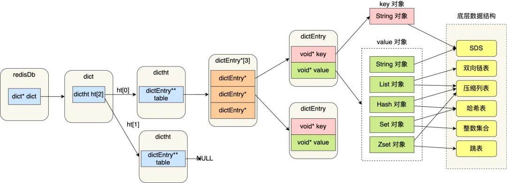

[回目录](/docs/software)  《分布式缓存redis》

## 1. 安装使用
https://redis.io/topics/quickstart

### 1.1 简单安装

```
yum install gcc

$ wget https://download.redis.io/releases/redis-6.2.1.tar.gz
$ tar xzf redis-6.2.1.tar.gz
$ cd redis-6.2.1
$ make

make test
sudo cp src/redis-server /usr/local/bin/
sudo cp src/redis-cli /usr/local/bin/

卸载的时候别忘记
rm /usr/local/bin/redis-server
rm /usr/local/bin/redis-cli
```

### 1.2 生产环境安装（推荐）

> Installing Redis more properly
> Running Redis from the command line is fine just to hack a bit with it or for development. However at some point you'll have some actual application to run on a real server. For this kind of usage you have two different choices:
> 
> + Run Redis using screen.
> + Install Redis in your Linux box in a proper way using an init script, so that after a restart everything will start again properly.
> A proper install using an init script is strongly suggested. The following instructions can be used to perform a proper installation using the init script shipped with Redis 2.4 in a Debian or Ubuntu based distribution.
> 
> We assume you already copied redis-server and redis-cli executables under /usr/local/bin.
> + Create a directory in which to store your Redis config files and your data:
> sudo mkdir /etc/redis
> sudo mkdir /var/redis
> + Copy the init script that you'll find in the Redis distribution under the utils directory into /etc/init.d. We suggest calling it with the name of the port where you are running this instance of Redis. For example:
> sudo cp utils/redis_init_script /etc/init.d/redis_6379
> + Edit the init script.
> sudo vi /etc/init.d/redis_6379
> ...
> https://redis.io/topics/quickstart

### 1.3 单节点启动 Single node
```
redis-server
Or start with config
redis-server redis.conf
```

### 1.4 集群启动 Cluster Mode
Redis cluster tutorial https://redis.io/topics/cluster-tutorial

Config:

```
daemonize yes  #后台运行模式
logfile “redis_6379_log”
pidfile /home/web/redis/var/run/redis_6379.pid  #修改pid文件
dir /home/web/redis/data/ #指定本地数据库存放目录
port 6379  #端口
dbfilename dump_6379.rdb #数据文件
appendfilename "appendonly_6379.aof"
cluster-enabled yes #打开注释，启动cluster模式
cluster-config-file nodes-6379.conf #打开注释，启动cluster模式
# Cluster node timeout is the amount of milliseconds a node must be unreachable
# for it to be considered in failure state.
# Most other internal time limits are multiple of the node timeout.
cluster-node-timeout 15000 #打开注释，启动cluster模式
```
参考最低配置：https://redis.io/topics/cluster-tutorial
_Note that the minimal cluster that works as expected requires to contain at least three master nodes._

#### 使用utils脚本

位置：redis/utils/create-cluster/README

To create a cluster, follow these steps:

1. Edit create-cluster and change the start / end port, depending on the
number of instances you want to create.
2. Use "./create-cluster start" in order to run the instances.
3. Use "./create-cluster create" in order to execute redis-cli --cluster create, so that
an actual Redis cluster will be created.
4. Now you are ready to play with the cluster. AOF files and logs for each instances are created in the current directory.                                                            

In order to stop a cluster:

1. Use "./create-cluster stop" to stop all the instances. After you stopped the instances you can use "./create-cluster start" to restart them if you change your mind.               
2. Use "./create-cluster clean" to remove all the AOF / log files to restart with a clean environment.                         


#### 手动创建

```
redis-server conf/redis6379.conf
redis-server conf/redis6380.conf
redis-server conf/redis6381.conf
redis-cli --cluster create <HOSTIP1>:6379 <HOSTIP1>:6380 <HOSTIP1>:6381 \
<HOSTIP2>:6379 <HOSTIP2>:6380 <HOSTIP2>:6381 \
<HOSTIP3>:6379 <HOSTIP3>:6380 <HOSTIP3>:6381 \
--cluster-replicas 2

>>> Performing hash slots allocation on 9 nodes...   
Master[0] -> Slots 0 - 5460                            
Master[1] -> Slots 5461 - 10922                                                                    
Master[2] -> Slots 10923 - 16383            
Adding replica HOSTIP2:6380 to HOSTIP1:6379
Adding replica HOSTIP3:6380 to HOSTIP1:6379
Adding replica HOSTIP1:6381 to HOSTIP2:6379
Adding replica HOSTIP3:6381 to HOSTIP2:6379
Adding replica HOSTIP2:6381 to HOSTIP3:6379        
Adding replica HOSTIP1:6380 to HOSTIP3:6379     
M: afabffee7a9076d42c9640a77ae2db6e6eb52fae HOSTIP1:6379           
   slots:[0-5460] (5461 slots) master                           
S: f24a6554ed2b64b071122bd16c7201aca1b184d0 HOSTIP1:6380                               
   replicates 36d8fdd4eaedd2f601a2e27d9856d9b82dd8017c               
S: bb483966fa9a7d60c9020a75d19fb2a4d1e8acf0 HOSTIP1:6381
   replicates b78a3f4b07cc5cf58a871abcb4cc01fcbc05e96d             
M: b78a3f4b07cc5cf58a871abcb4cc01fcbc05e96d HOSTIP2:6379
   slots:[5461-10922] (5462 slots) master                                   
S: 27c88c277aa82340f5e2f9d73078d59399ed6b87 HOSTIP2:6380 
   replicates afabffee7a9076d42c9640a77ae2db6e6eb52fae                
S: 56ce383e2cb6affedd61317cfb35b05f29dfc7f1 HOSTIP2:6381 
   replicates 36d8fdd4eaedd2f601a2e27d9856d9b82dd8017c     
M: 36d8fdd4eaedd2f601a2e27d9856d9b82dd8017c HOSTIP3:6379     
   slots:[10923-16383] (5461 slots) master               
S: 54d6095aca3e1edd27761e080651bb28144e3a81 HOSTIP3:6380
   replicates afabffee7a9076d42c9640a77ae2db6e6eb52fae
S: 9f92fe21d31b4b18f54321fbedc809ca4afcf187 HOSTIP3:6381
   replicates b78a3f4b07cc5cf58a871abcb4cc01fcbc05e96d
Can I set the above configuration? (type 'yes' to accept): yes
>>> Nodes configuration updated
>>> Assign a different config epoch to each node
>>> Sending CLUSTER MEET messages to join the cluster
Waiting for the cluster to join
...
>>> Performing Cluster Check (using node HOSTIP1:6379)
M: afabffee7a9076d42c9640a77ae2db6e6eb52fae HOSTIP1:6379
   slots:[0-5460] (5461 slots) master
   2 additional replica(s)
S: bb483966fa9a7d60c9020a75d19fb2a4d1e8acf0 HOSTIP1:6381
   slots: (0 slots) slave
   replicates b78a3f4b07cc5cf58a871abcb4cc01fcbc05e96d
S: 27c88c277aa82340f5e2f9d73078d59399ed6b87 HOSTIP2:6380
   slots: (0 slots) slave
   replicates afabffee7a9076d42c9640a77ae2db6e6eb52fae
M: b78a3f4b07cc5cf58a871abcb4cc01fcbc05e96d HOSTIP2:6379
   slots:[5461-10922] (5462 slots) master
   2 additional replica(s)
S: 9f92fe21d31b4b18f54321fbedc809ca4afcf187 HOSTIP3:6381
   slots: (0 slots) slave
   replicates b78a3f4b07cc5cf58a871abcb4cc01fcbc05e96d
S: 54d6095aca3e1edd27761e080651bb28144e3a81 HOSTIP3:6380
   slots: (0 slots) slave
   replicates afabffee7a9076d42c9640a77ae2db6e6eb52fae
S: 56ce383e2cb6affedd61317cfb35b05f29dfc7f1 HOSTIP2:6381
   slots: (0 slots) slave
   replicates 36d8fdd4eaedd2f601a2e27d9856d9b82dd8017c
S: f24a6554ed2b64b071122bd16c7201aca1b184d0 HOSTIP1:6380
   slots: (0 slots) slave
   replicates 36d8fdd4eaedd2f601a2e27d9856d9b82dd8017c
M: 36d8fdd4eaedd2f601a2e27d9856d9b82dd8017c HOSTIP3:6379
   slots:[10923-16383] (5461 slots) master
   2 additional replica(s)
[OK] All nodes agree about slots configuration.
>>> Check for open slots...
>>> Check slots coverage...
[OK] All 16384 slots covered.

```

重建集群：
要想删除一个集群，首先关闭Redis服务，方法如下：

redis-cli -h 127.0.0.1 -p 7000 shutdown

关闭所有集群上节点后，进入各个节点文件夹，删除以下文件：

appendonly.aof
dump.rdb
nodes-7000.conf
批量删除指令如下：

`rm -f ./*/nodes-*.conf ./*/appendonly.aof ./*/dump.rdb`

#### customize脚本

```
REDIS_HOME=/opt/redis-5.0.5/src
pushd ${REDIS_HOME} &>/dev/null

while [ "${1:0:1}" == "-" ]; do
  case $1 in
    --start)
      echo "Starting redis nodes..."
      redis-server conf/redis6379.conf
      redis-server conf/redis6380.conf
      redis-server conf/redis6381.conf
      ;;
    --create-cluster)
    	redis-cli --cluster create HOST1:6379 HOST1:6380 HOST1:6381 ....HOST2... --cluster-replicas 2
    --kill)
      echo "Stopping redis nodes..."
      redis-cli -p 6379 shutdown
      redis-cli -p 6380 shutdown
      redis-cli -p 6381 shutdown
          ;;
    --clear-cache)
      masterNodes=($(./redis-cli cluster nodes | grep master | awk '{ print $2 }'))
      testArray=(${masterNodes[@]})
      echo ${testArray[0]}
      for item in "${masterNodes[@]}"; do
                host="$(cut -d':' -f1 <<<$item)"
                tmp="$(cut -d':' -f2 <<<$item)"
                port="$(cut -d'@' -f1 <<<$tmp)"
                redis-cli -c -h ${serverIp} -p ${port} flushall
        done
    *)
      echo "usage: --start|--kill"
      exit 1
      ;;
  esac
  shift
done

```

### 1.5 Config

#### common config

+ replica-read-only

```
# Since Redis 2.6 by default replicas are read-only.
#
# Note: read only replicas are not designed to be exposed to untrusted clients
# on the internet. It's just a protection layer against misuse of the instance.
# Still a read only replica exports by default all the administrative commands
# such as CONFIG, DEBUG, and so forth. To a limited extent you can improve
# security of read only replicas using 'rename-command' to shadow all the
# administrative / dangerous commands.
replica-read-only yes
```

+ Allow writes only with N attached replicas

```
# It is possible for a master to stop accepting writes if there are less than
# N replicas connected, having a lag less or equal than M seconds.
#
# The N replicas need to be in "online" state.
#
# The lag in seconds, that must be <= the specified value, is calculated from
# the last ping received from the replica, that is usually sent every second.
#
# This option does not GUARANTEE that N replicas will accept the write, but
# will limit the window of exposure for lost writes in case not enough replicas
# are available, to the specified number of seconds.
#
# For example to require at least 3 replicas with a lag <= 10 seconds use:
#
# min-replicas-to-write 3
# min-replicas-max-lag 10
#
# Setting one or the other to 0 disables the feature.
#
# By default min-replicas-to-write is set to 0 (feature disabled) and
# min-replicas-max-lag is set to 10.
```

#### cluster config

- **cluster-enabled `<yes/no>`**: If yes, enables Redis Cluster support in a specific Redis instance.  Otherwise the instance starts as a stand alone instance as usual.

- **cluster-config-file `<filename>`**: Note that despite the name of this option, this is not a user editable  configuration file, but the file where a Redis Cluster node  automatically persists the cluster configuration (the state, basically)  every time there is a change, in order to be able to re-read it at  startup. The file lists things like the other nodes in the cluster,  their state, persistent variables, and so forth. Often this file is  rewritten and flushed on disk as a result of some message reception.

- **cluster-node-timeout `<milliseconds>`**: The maximum amount of time a Redis Cluster node can be unavailable,  without it being considered as failing. If a master node is not  reachable for more than the specified amount of time, it will be failed  over by its slaves. This parameter controls other important things in  Redis Cluster. Notably, every node that can't reach the majority of  master nodes for the specified amount of time, will stop accepting  queries.

- **cluster-slave-validity-factor `<factor>`**: If set to zero, a slave will always consider itself valid, and will  therefore always try to failover a master, regardless of the amount of  time the link between the master and the slave remained disconnected. If the value is positive, a maximum disconnection time is calculated as  the *node timeout* value multiplied by the factor provided with  this option, and if the node is a slave, it will not try to start a  failover if the master link was disconnected for more than the specified amount of time. For example, if the node timeout is set to 5 seconds  and the validity factor is set to 10, a slave disconnected from the  master for more than 50 seconds will not try to failover its master.  Note that any value different than zero may result in Redis Cluster  being unavailable after a master failure if there is no slave that is  able to failover it. In that case the cluster will return to being  available only when the original master rejoins the cluster.

- **cluster-migration-barrier `<count>`**: Minimum number of slaves a master will remain connected with, for  another slave to migrate to a master which is no longer covered by any  slave. See the appropriate section about replica migration in this  tutorial for more information.

  ```
  
  # Cluster replicas are able to migrate to orphaned masters, that are masters
  # that are left without working replicas. This improves the cluster ability
  # to resist to failures as otherwise an orphaned master can't be failed over
  # in case of failure if it has no working replicas.
  #
  # Replicas migrate to orphaned masters only if there are still at least a
  # given number of other working replicas for their old master. This number
  # is the "migration barrier". A migration barrier of 1 means that a replica
  # will migrate only if there is at least 1 other working replica for its master
  # and so forth. It usually reflects the number of replicas you want for every
  # master in your cluster.
  #
  # Default is 1 (replicas migrate only if their masters remain with at least
  # one replica). To disable migration just set it to a very large value.
  # A value of 0 can be set but is useful only for debugging and dangerous
  # in production.
  #
  cluster-migration-barrier 1
  意思是 当mater node A的replica都挂了之后，A变成了 orphaned master node，如果B现在有两个replica，那其中一个replica就可以自动migrate，变成A的replica，然后B就剩一个replica，如果B本来只有一个replica，那么B的replica就不可以migrate成为A的replica，因为barrier是1
  ```

  

- **cluster-require-full-coverage `<yes/no>`**: If this is set to yes, as it is by default, the cluster stops accepting writes if some percentage of the key space is not covered by any node.  If the option is set to no, the cluster will still serve queries even if only requests about a subset of keys can be processed.

- **cluster-allow-reads-when-down `<yes/no>`**: If this is set to no, as it is by default, a node in a Redis Cluster  will stop serving all traffic when the cluster is marked as failed,  either when a node can't reach a quorum of masters or when full coverage is not met. This prevents reading potentially inconsistent data from a  node that is unaware of changes in the cluster. This option can be set  to yes to allow reads from a node during the fail state, which is useful for applications that want to prioritize read availability but still  want to prevent inconsistent writes. It can also be used for when using  Redis Cluster with only one or two shards, as it allows the nodes to  continue serving writes when a master fails but automatic failover is  impossible.

- cluster-slave-no-failover=》cluster-replica-no-failover

  ```
  # This option, when set to yes, prevents replicas from trying to failover its
  # master during master failures. However the master can still perform a
  # manual failover, if forced to do so.
  #
  # This is useful in different scenarios, especially in the case of multiple
  # data center operations, where we want one side to never be promoted if not
  # in the case of a total DC failure.
  ```

  https://github.com/redis/redis/issues/3021

### 1.6 commands

```
$ redis-cli -c -h <HOSTIP> -p <PORT>

redis> AUTH 'password'
redis> ACL LIST

redis> KEYS 
redis> KEYS "<PATTEN>"

$ redis-cli KEYS "<PATTEN>" | xargs redis-cli DEL

redis-cli --scan --pattern "<PATTEN>" | xargs redis-cli DEL

//字符串(string)
redis> GET <KEY>
redis> SET <KEY> <VALUE>

//哈希(Hash) HSET KEY_NAME FIELD VALUE 
redis 127.0.0.1:6379> HSET myhash field1 "foo"
OK
redis 127.0.0.1:6379> HGET myhash field1
"foo"

redis 127.0.0.1:6379> HSET website google "www.g.cn"       # 设置一个新域
(integer) 1

redis 127.0.0.1:6379>HSET website google "www.google.com" # 覆盖一个旧域
(integer) 0

//列表(List) LRANGE KEY_NAME START END
redis> RPUSH mylist "one"
(integer) 1
redis> RPUSH mylist "two"
(integer) 2
redis> RPUSH mylist "three"
(integer) 3
redis> LRANGE mylist 0 0
1) "one"
redis> LRANGE mylist -3 2
1) "one"
2) "two"
3) "three"
redis> LRANGE mylist -100 100
1) "one"
2) "two"
3) "three"
redis> LRANGE mylist 5 10
(empty list or set)
redis> 

//无序集合(Set) SADD key member [member ...]
redis 127.0.0.1:6379> SADD runoobkey redis
(integer) 1
redis 127.0.0.1:6379> SADD runoobkey mongodb
(integer) 1
redis 127.0.0.1:6379> SADD runoobkey mysql
(integer) 1
redis 127.0.0.1:6379> SADD runoobkey mysql
(integer) 0
redis 127.0.0.1:6379> SMEMBERS runoobkey

1) "mysql"
2) "mongodb"
3) "redis"

//有序集合(sorted set) ZADD KEY_NAME SCORE1 VALUE1.. SCOREN VALUEN
redis> ZADD myzset 1 "one"
(integer) 1
redis> ZADD myzset 1 "uno"
(integer) 1
redis> ZADD myzset 2 "two" 3 "three"
(integer) 2
redis> ZRANGE myzset 0 -1 WITHSCORES

ZRANGEBYSCORE myzset -inf 1

```

### 1.7 Restore an RDB file
If you have an RDB file dump.rdb that contains the data you want you can use this file to create a new database

Copy the dump.rdb file into the Redis working directory

If you do not know what it is folder you can run the command `CONFIG get dir` where your Redis instance is up and running

Start the Redis service with the redis-server

The file dump.rdb is automatically imported.

Connect to the database using redis-cli or any other client, to check that data have been imported. (for example SCAN)

## 2. 理论基础 Theory

学习redis源码过程笔记、问题记录，通过代码阅读熟悉分布式NOSQL数据库redis cluster集群功能、主从复制，节点扩容、槽位迁移、failover故障切换、一致性选举完整分析，对理解redis源码很有帮助  https://github.com/daniel416/Reading-and-comprehense-redis/

https://redis.io/topics/cluster-spec

An introduction to Redis data types and abstractions https://redis.io/topics/data-types-intro

### 2.1 基本

#### Replication

https://redis.io/topics/replication

#### Redis Sentinel vs Redis Cluster


https://stackoverflow.com/questions/31143072/redis-sentinel-vs-clustering

### 2.2 Redis Cluster

Goals:

- High performance and linear scalability up to 1000  nodes. There are no proxies, asynchronous replication is used, and no  merge operations are performed on values.

  默认是异步的replica，如果需要同步，则可利用 WAIT 命令

- Acceptable degree of write safety: the system tries (in a best-effort way) to retain all the writes originating from clients  connected with the majority of the master nodes. Usually there are small windows where acknowledged writes can be lost. Windows to lose  acknowledged writes are larger when clients are in a minority partition.

- Availability: Redis Cluster is able to survive  partitions where the majority of the master nodes are reachable and  there is at least one reachable slave for every master node that is no  longer reachable. Moreover using *replicas migration*, masters no longer replicated by any slave will receive one from a master which is covered by multiple slaves.

#### Cluster Gossip Protocol

+ Every node maintains the following information about other nodes that it is aware of in the cluster: 

  The node ID, IP and port of the node, a set of flags, what is the master of the node if it is flagged as slave, last time the node was pinged and the last time the pong was received, the current configuration epoch of the node, the link state and finally the set of hash slots served.

+ Cluster Bus --- TCP PORTS

  Every Redis Cluster node requires two TCP connections open. The normal Redis TCP port used to serve clients, for example 6379, plus the port obtained by adding 10000 to the data port, so 16379 in the example.

#### Cluster DATA SHARDING

16384 slots, hash slot 哈希槽位（*dict大小）又称为bucket桶（不过很多地方都特指 *dictEntry为桶）,why ? https://cloud.tencent.com/developer/article/1042654
16384这个数字也不是作者随意指定的，Redis集群内部使用位图（bit map）来标志一个slot是否被占用，为了减少集群之间信息交换的大小，信息的大小被固定为2048字节
2048 bytes = 2^11 * 8 bit= 2^14 bit= 16384

to compute what is the hash slot of a given key, we simply take the CRC16 of the key modulo 16384.

```
HASH_SLOT = CRC16(key) mod 16384
```

14 out of 16 CRC16 output bits are used (this is why there is a modulo 16384 operation in the formula above).

Hash tag and multiple key operations 
this{foo}key and another{foo}key are guaranteed to be in the same hash slot, and can be used together in a command with multiple keys as arguments
redis集群不支持模糊匹配partial match，想要模糊匹配只能对一个个server或database操作，不可以整体cluster操作，不过hash tag可以潜在解决这个问题

#### Consitensy guarantee

Redis Cluster is not able to guarantee strong consistency. In practical terms this means that under certain conditions it is possible that Redis Cluster will lose writes that were acknowledged by the system to the client.
Tradeoff between Synchronous write and Performance

+ scenario 1： Asynchronous writes

  Your client writes to the master B. =》 The master B replies OK to your client. =》The master B propagates the write to its slaves B1, B2 and B3.

  As you can see, B does not wait for an acknowledgement from B1, B2, B3 before replying to the client, since this would be a prohibitive latency penalty for Redis, so if your client writes something, B acknowledges the write, but crashes before being able to send the write to its slaves, one of the slaves (that did not receive the write) can be promoted to master, losing the write forever.

  This is very similar to what happens with most databases that are configured to flush data to disk every second, so it is a scenario you are already able to reason about because of past experiences with traditional database systems not involving distributed systems. Similarly you can improve consistency by forcing the database to flush data to disk before replying to the client, but this usually results in prohibitively low performance. That would be the equivalent of synchronous replication in the case of Redis Cluster.

+ Scenario 2： synchronous writes

  Redis Cluster has support for synchronous writes when absolutely needed, implemented via the WAIT command. This makes losing writes a lot less likely. However, note that Redis Cluster does not implement strong consistency even when synchronous replication is used: it is always possible, under more complex failure scenarios, that a slave that was not able to receive the write will be elected as master.

+ Scenario 3：network partition

  There is also a client, that we will call Z1.

  After a partition occurs, it is possible that in one side of the partition we have A, C, A1, B1, C1, and in the other side we have B and Z1.

  Z1 is still able to write to B, which will accept its writes. If the partition heals in a very short time, the cluster will continue normally. However, if the partition lasts enough time for B1 to be promoted to master on the majority side of the partition, the writes that Z1 has sent to B in the mean time will be lost.

  Note that there is a maximum window to the amount of writes Z1 will be able to send to B: if enough time has elapsed for the majority side of the partition to elect a slave as master, every master node in the minority side will have stopped accepting writes.

  This amount of time is a very important configuration directive of Redis Cluster, and is called the node timeout.

  After node timeout has elapsed, a master node is considered to be failing, and can be replaced by one of its replicas. Similarly, after node timeout has elapsed without a master node to be able to sense the majority of the other master nodes, it enters an error state and stops accepting writes.

  

#### currentEpoch & configEpoch

+ currentEpoch

  Redis Cluster uses a concept similar to the Raft algorithm "term". In Redis Cluster the term is called epoch instead, and it is used in order to give incremental versioning to events. When multiple nodes provide  conflicting information, it becomes possible for another node to  understand which state is the most up to date.

  The `currentEpoch` is a 64 bit unsigned number.

  At node creation every Redis Cluster node, both slaves and master nodes, set the `currentEpoch` to 0.

+ configEpoch

  Every master always advertises its `configEpoch` in ping and pong packets along with a bitmap advertising the set of slots it serves.

  The `configEpoch` is set to zero in masters when a new node is created.

  A new `configEpoch` is created during slave election. 

  

This mechanism in Redis Cluster is called last failover wins.
When a slave fails over its master, it obtains a configuration epoch which is guaranteed to be greater than the one of its master (and more generally greater than any other configuration epoch generated previously). For example node B, which is a slave of A, may failover B with configuration epoch of 4. It will start to send heartbeat packets (the first time mass-broadcasting cluster-wide) and because of the following second rule, receivers will update their hash slot tables

The same happens during reshardings. When a node importing a hash slot completes the import operation, its configuration epoch is incremented to make sure the change will be propagated throughout the cluster.

>Practical example of configuration epoch usefulness during partitions
>This section illustrates how the epoch concept is used to make the slave promotion process more resistant to partitions.

> + A master is no longer reachable indefinitely. The master has three slaves A, B, C.
> + Slave A wins the election and is promoted to master.
> + A network partition makes A not available for the majority of the cluster.
> + Slave B wins the election and is promoted as master.
> + A partition makes B not available for the majority of the cluster.
> + The previous partition is fixed, and A is available again.
>   At this point B is down and A is available again with a role of master (actually UPDATE messages would reconfigure it promptly, but here we assume all UPDATE messages were lost). At the same time, slave C will try to get elected in order to fail over B. This is what happens:

> 1.C will try to get elected and will succeed, since for the majority of masters its master is actually down. It will obtain a new incremental configEpoch.
> 2.A will not be able to claim to be the master for its hash slots, because the other nodes already have the same hash slots associated with a higher configuration epoch (the one of B) compared to the one published by A.
> 3.So, all the nodes will upgrade their table to assign the hash slots to C, and the cluster will continue its operations.
> https://redis.io/topics/cluster-spec


#### Cluster failover strategy 主从切换

集群是否工作状态可以通过 cluster info查看cluster_state

对于一个N个master node的集群来说，如果每个master node有一个slave，总共就是2N个节点：

1）任何一个节点挂掉或者被network partitioned away都不影响整体的工作，如果是slave挂，没有影响，如果是master挂，其replica会被选举为新的master，依然没有影响

2）如果一个master和其slave同时挂，则cluster无法工作（实际上不会“同时”，肯定是有时间差的，可以利用replica migration提高此情况下的可用性）

3）如果一个master挂掉，并且没有slave，集群无法工作

4）超半数master挂掉，集群无法选举，从而无法工作

N建议为奇数：

比如3个master节点和4个master节点的集群相比，如果都挂了一个master节点都能选举新master节点，如果都挂了两个master节点都没法选举新master节点了，所以奇数的master节点可以节省机器资源

##### Step 1: Failure detection

**PFAIL (*Possible failure*) flag:**

A node flags another node with the `PFAIL` flag when the node is not reachable for more than `NODE_TIMEOUT` time. Both master and slave nodes can flag another node as `PFAIL`, regardless of its type.

**FAIL flag:**

The `PFAIL` flag alone is just local  information every node has about other nodes, but it is not sufficient  to trigger a slave promotion. For a node to be considered down the `PFAIL` condition needs to be escalated to a `FAIL` condition.

A `PFAIL` condition is escalated to a `FAIL` condition when the following set of conditions are met:

- Some node, that we'll call A, has another node B flagged as `PFAIL`.
- Node A collected, via gossip sections, information about the state of B from the point of view of the majority of masters in the cluster.
- The majority of masters signaled the `PFAIL` or `FAIL` condition within `NODE_TIMEOUT * FAIL_REPORT_VALIDITY_MULT` time. (The validity factor is set to 2 in the current implementation, so this is just two times the `NODE_TIMEOUT` time).

If all the above conditions are true, Node A will:

- Mark the node as `FAIL`.
- Send a `FAIL` message to all the reachable nodes.

Note that *the FAIL flag is mostly one way*. That is, a node can go from `PFAIL` to `FAIL`, but a `FAIL` flag can only be cleared in the following situations:

- The node is already reachable and is a slave. In this case the `FAIL` flag can be cleared as slaves are not failed over.
- The node is already reachable and is a master not serving any slot. In this case the `FAIL` flag can be cleared as masters without slots do not really participate  in the cluster and are waiting to be configured in order to join the  cluster.
- The node is already reachable and is a master, but a long time (N times the `NODE_TIMEOUT`) has elapsed without any detectable slave promotion. It's better for it to rejoin the cluster and continue in this case.

However the Redis Cluster failure detection has a liveness  requirement: eventually all the nodes should agree about the state of a  given node. There are two cases that can originate from split brain  conditions. Either some minority of nodes believe the node is in `FAIL` state, or a minority of nodes believe the node is not in `FAIL` state. In both the cases eventually the cluster will have a single view of the state of a given node:

**Case 1**: If a majority of masters have flagged a node as `FAIL`, because of failure detection and the *chain effect* it generates, every other node will eventually flag the master as `FAIL`, since in the specified window of time enough failures will be reported.

**Case 2**: When only a minority of masters have flagged a node as `FAIL`, the slave promotion will not happen (as it uses a more formal algorithm that makes sure everybody knows about the promotion eventually) and  every node will clear the `FAIL` state as per the `FAIL` state clearing rules above (i.e. no promotion after N times the `NODE_TIMEOUT` has elapsed).

##### Step 2: Slave election and promotion

Slave election and promotion is handled by slave nodes

In order for a slave to promote itself to master, it needs to start  an election and win it. All the slaves for a given master can start an  election if the master is in `FAIL` state, however only one slave will win the election and promote itself to master.

A slave starts an election when the following conditions are met:

- The slave's master is in `FAIL` state.
- The master was serving a non-zero number of slots.
- The slave replication link was disconnected from the  master for no longer than a given amount of time, in order to ensure the promoted slave's data is reasonably fresh. This time is user  configurable.


step 1) slave increment its `currentEpoch` counter, and request votes from master instances.

step 2) Request Votes: broadcasting a `FAILOVER_AUTH_REQUEST` packet to every master node of the cluster. Then it waits for a maximum time of two times the `NODE_TIMEOUT` for replies to arrive (but always for at least 2 seconds).

A slave discards any `AUTH_ACK` replies with an epoch that is less than the `currentEpoch` at the time the vote request was sent. This ensures it doesn't count votes intended for a previous election.

step 3) Once a master has voted for a given slave, replying positively with a `FAILOVER_AUTH_ACK`, it can no longer vote for another slave of the same master for a period of `NODE_TIMEOUT * 2`. In this period it will not be able to reply to other authorization  requests for the same master. This is not needed to guarantee safety,  but useful for preventing multiple slaves from getting elected (even if  with a different `configEpoch`) at around the same time, which is usually not wanted.

how master votes:

i. A master only votes a single time for a given epoch, and refuses to vote for older epochs: every master has a lastVoteEpoch  field and will refuse to vote again as long as the `currentEpoch` in the auth request packet is not greater than the lastVoteEpoch. When a master replies positively to a vote request, the lastVoteEpoch is  updated accordingly, and safely stored on disk.

ii. A master votes for a slave only if the slave's master is flagged as `FAIL`.

iii. Auth requests with a `currentEpoch` that is less than the master `currentEpoch` are ignored. Because of this the master reply will always have the same `currentEpoch` as the auth request. If the same slave asks again to be voted, incrementing the `currentEpoch`, it is guaranteed that an old delayed reply from the master can not be accepted for the new vote.

step 4) Once the slave receives ACKs from the majority of masters, it wins the election. Otherwise if the majority is not reached within the period of two times `NODE_TIMEOUT` (but always at least 2 seconds), the election is aborted and a new one will be tried again after `NODE_TIMEOUT * 4` (and always at least 4 seconds).

Once a slave wins the election, it obtains a new unique and incremental `configEpoch` which is higher than that of any other existing master. It starts  advertising itself as master in ping and pong packets, providing the set of served slots with a `configEpoch` that will win over the past ones.

In order to speedup the reconfiguration of other nodes, a pong packet is broadcast to all the nodes of the cluster. Currently unreachable nodes  will eventually be reconfigured when they receive a ping or pong packet  from another node or will receive an `UPDATE` packet from another node if the information it publishes via heartbeat packets are detected to be out of date.

The other nodes will detect that there is a new master serving the same slots served by the old master but with a greater `configEpoch`, and will upgrade their configuration. Slaves of the old master (or the  failed over master if it rejoins the cluster) will not just upgrade the  configuration but will also reconfigure to replicate from the new  master. 

##### Example

- A master is no longer reachable indefinitely. The master has three slaves A, B, C.
- Slave A wins the election and is promoted to master.
- A network partition makes A not available for the majority of the cluster.
- Slave B wins the election and is promoted as master.
- A partition makes B not available for the majority of the cluster.
- The previous partition is fixed, and A is available again.

At this point B is down and A is available again with a role of master (actually `UPDATE` messages would reconfigure it promptly, but here we assume all `UPDATE` messages were lost). At the same time, slave C will try to get elected in order to fail over B. This is what happens:

1. C will try to get elected and will succeed, since for  the majority of masters its master is actually down. It will obtain a  new incremental `configEpoch`.
2. A will not be able to claim to be the master for its  hash slots, because the other nodes already have the same hash slots  associated with a higher configuration epoch (the one of B) compared to  the one published by A.
3. So, all the nodes will upgrade their table to assign the hash slots to C, and the cluster will continue its operations.

##### Case 1: network partition 短暂的脑裂

除了Step 1提到的选举过程中的脑裂问题，选举前的读写也存在短暂的脑裂问题：

Majority master nodes：A B

Minority master nodes：C

1) A write may reach a master, but while the master may be able to reply to the client, the write may not be propagated to slaves via the  asynchronous replication used between master and slave nodes. If the  master dies without the write reaching the slaves, the write is lost  forever if the master is unreachable for a long enough period that one  of its slaves is promoted. 

2) A client with an out-of-date routing table may write to the old master  before it is converted into a slave (of the new master) by the cluster.

Notes：

for a master to be failed over it must be unreachable by the majority of masters for at least `NODE_TIMEOUT`, so if the partition is fixed before that time, no writes are lost. When the partition lasts for more than `NODE_TIMEOUT`, all the writes performed in the minority side up to that point may be  lost. However the minority side of a Redis Cluster will start refusing  writes as soon as `NODE_TIMEOUT` time has elapsed without  contact with the majority, so there is a maximum window after which the  minority becomes no longer available. Hence, no writes are accepted or  lost after that time.

##### Case 2: master fail=>slave promote to master

A<-A1

B<-B1

C<-C1

In our example cluster with nodes A, B, C, if node B fails the cluster is not able to continue, since we no longer have a way to serve hash slots in the range 5501-11000.

However when the cluster is created (or at a later time) we add a slave node to every master, so that the final cluster is composed of A, B, C that are master nodes, and A1, B1, C1 that are slave nodes. This way, the system is able to continue if node B fails.

Node B1 replicates B, and B fails, the cluster will promote node B1 as the new master and will continue to operate correctly.

However, note that if nodes B and B1 fail at the same time, Redis Cluster is not able to continue to operate.

##### Case 3: mater & slave both fail, but slave fail first

或者说出现orphaned master node的情况

**解决方法:**

replica migration，参考配置 **cluster-migration-barrier `<count>`**:

如果 **cluster-migration-barrier `1`**，对于cluster：

A<-A1

B<-B1

C<-C1

需要增加机器VM4，然后VM4可以有一个或两个replica，比如：

A<-A2

C<-C2

或

A<-A2

A<-A3

如果 B1挂掉，B就成为了 orphaned master nodes，（如果B再挂掉，就无法提供服务，simply because there is no other instance to have a copy of the hash slots the master was serving.），所以引入了replica migration，就是当B1挂掉后，因为A有A1和A2等多个replica，所以其中一个可以migration称为B的replica，这样即使B再挂掉，仍然有一个replica可以被promote成为B，可能你会问，这么麻烦，给每个master node都搞多个replica不行吗，当然可以，不过 this is expensive.

##### Case 4：Slave of Slave node

Redis的主从关系是链式的，一个从节点也是可以拥有从节点的，

当一个主A和从A1同时挂掉，A2被选举为新主，然后先重启A，主就会变成A2的从节点，再重启A1，A1仍然会是A的从节点，从而出现链式：A1->A->A2

解决办法：

cluster replicate 为A1指定主节点

##### Case 5：网络不稳定，频繁主从切换

解决办法：合理修正cluster-node-timeout

Once the slave receives ACKs from the majority of masters, it wins the election.  Otherwise if the majority is not reached within the period of two times `NODE_TIMEOUT` (but always at least 2 seconds), the election is aborted and a new one will be tried again after `NODE_TIMEOUT * 4` (and always at least 4 seconds).

As soon as a master is in `FAIL` state, a slave waits a short period of time before trying to get elected. That delay is computed as follows:

```
DELAY = 500 milliseconds + random delay between 0 and 500 milliseconds +
        SLAVE_RANK * 1000 milliseconds.
```

The fixed delay ensures that we wait for the `FAIL` state to propagate across the cluster, otherwise the slave may try to get elected while the masters are still unaware of the `FAIL` state, refusing to grant their vote.


##### Case 6: 常见现象：master nodes aggregate 

假设3台机器M1 M2 M3, 创建cluster，3个master A B C，3个slave(或者6个slave) A1 B1 C1，一般会平均分配：

```
M1: A B1
M2: B C1
M3: C A1

假设M2 down，
M1: A B
M3: C A1

M2 up后，
M1: A B
M2: B1 C1
M3: C A1

可以看到M2并不会争夺回B，所以很容易推算当6个slave的情况下，极有可能，最终master节点全部跑到一台机器上
```

观点：kafka中类似的概念是topic leader和follower的分配，不同的是，当down掉的节点起来之后会抢夺回之前的topic leader，从而使得节点总是很平均，而redis不会抢夺，所以会越来越集中

https://blog.csdn.net/zhouwenjun0820/article/details/105893144

**解决办法：**

参考 3.2 自动方式管理=> cluster failover 进行调整

```
HOST1:6379> cluster nodes
afabffee7a9076d42c9640a77ae2db6e6eb52fae HOST1:6379@16379 myself,slave 27c88c277aa82340f5e2f9d73078d59399ed6b87 0 1632299474000 13 connected
9f92fe21d31b4b18f54321fbedc809ca4afcf187 HOST3:6381@16381 slave b78a3f4b07cc5cf58a871abcb4cc01fcbc05e96d 0 1632299477000 9 connected
27c88c277aa82340f5e2f9d73078d59399ed6b87 HOST2:6380@16380 master - 0 1632299475000 18 connected 0-5460
b78a3f4b07cc5cf58a871abcb4cc01fcbc05e96d HOST2:6379@16379 master - 0 1632299474000 4 connected 5461-10922
36d8fdd4eaedd2f601a2e27d9856d9b82dd8017c HOST3:6379@16379 slave 56ce383e2cb6affedd61317cfb35b05f29dfc7f1 0 1632299475000 15 connected
56ce383e2cb6affedd61317cfb35b05f29dfc7f1 HOST2:6381@16381 master - 0 1632299477133 15 connected 10923-16383
f24a6554ed2b64b071122bd16c7201aca1b184d0 HOST1:6380@16380 slave 56ce383e2cb6affedd61317cfb35b05f29dfc7f1 0 1632299476000 15 connected
54d6095aca3e1edd27761e080651bb28144e3a81 HOST3:6380@16380 slave 27c88c277aa82340f5e2f9d73078d59399ed6b87 0 1632299476000 18 connected
bb483966fa9a7d60c9020a75d19fb2a4d1e8acf0 HOST1:6381@16381 slave b78a3f4b07cc5cf58a871abcb4cc01fcbc05e96d 0 1632299476130 4 connected

HOST2:6380> connect HOST1 6379
HOST1:6379> cluster nodes
afabffee7a9076d42c9640a77ae2db6e6eb52fae HOST1:6379@16379 myself,master - 0 1632299972000 19 connected 0-5460
9f92fe21d31b4b18f54321fbedc809ca4afcf187 HOST3:6381@16381 slave b78a3f4b07cc5cf58a871abcb4cc01fcbc05e96d 0 1632299973000 9 connected
27c88c277aa82340f5e2f9d73078d59399ed6b87 HOST2:6380@16380 slave afabffee7a9076d42c9640a77ae2db6e6eb52fae 0 1632299974517 19 connected
b78a3f4b07cc5cf58a871abcb4cc01fcbc05e96d HOST2:6379@16379 master - 0 1632299972511 4 connected 5461-10922
36d8fdd4eaedd2f601a2e27d9856d9b82dd8017c HOST3:6379@16379 slave 56ce383e2cb6affedd61317cfb35b05f29dfc7f1 0 1632299971508 15 connected
56ce383e2cb6affedd61317cfb35b05f29dfc7f1 HOST2:6381@16381 master - 0 1632299974000 15 connected 10923-16383
f24a6554ed2b64b071122bd16c7201aca1b184d0 HOST1:6380@16380 slave 56ce383e2cb6affedd61317cfb35b05f29dfc7f1 0 1632299974000 15 connected
54d6095aca3e1edd27761e080651bb28144e3a81 HOST3:6380@16380 slave afabffee7a9076d42c9640a77ae2db6e6eb52fae 0 1632299971000 19 connected
bb483966fa9a7d60c9020a75d19fb2a4d1e8acf0 HOST1:6381@16381 slave b78a3f4b07cc5cf58a871abcb4cc01fcbc05e96d 0 1632299973514 4 connected

HOST1:6379> connect HOST3 6379
HOST3:6379> cluster failover
OK
HOST3:6379> cluster nodes
56ce383e2cb6affedd61317cfb35b05f29dfc7f1 HOST2:6381@16381 slave 36d8fdd4eaedd2f601a2e27d9856d9b82dd8017c 0 1632300416000 20 connected
f24a6554ed2b64b071122bd16c7201aca1b184d0 HOST1:6380@16380 slave 36d8fdd4eaedd2f601a2e27d9856d9b82dd8017c 0 1632300416000 20 connected
b78a3f4b07cc5cf58a871abcb4cc01fcbc05e96d HOST2:6379@16379 master - 0 1632300421801 4 connected 5461-10922
afabffee7a9076d42c9640a77ae2db6e6eb52fae HOST1:6379@16379 master - 0 1632300420800 19 connected 0-5460
27c88c277aa82340f5e2f9d73078d59399ed6b87 HOST2:6380@16380 slave afabffee7a9076d42c9640a77ae2db6e6eb52fae 0 1632300419000 19 connected
36d8fdd4eaedd2f601a2e27d9856d9b82dd8017c HOST3:6379@16379 myself,master - 0 1632300417000 20 connected 10923-16383
bb483966fa9a7d60c9020a75d19fb2a4d1e8acf0 HOST1:6381@16381 slave b78a3f4b07cc5cf58a871abcb4cc01fcbc05e96d 0 1632300419796 4 connected
54d6095aca3e1edd27761e080651bb28144e3a81 HOST3:6380@16380 slave afabffee7a9076d42c9640a77ae2db6e6eb52fae 0 1632300418793 19 connected
9f92fe21d31b4b18f54321fbedc809ca4afcf187 HOST3:6381@16381 slave b78a3f4b07cc5cf58a871abcb4cc01fcbc05e96d 0 1632300418000 9 connected
```


### 2.3 Sentinel


### 2.4 深度探索
[为了拿捏 Redis 数据结构，我画了 40 张图（完整版）](https://mp.weixin.qq.com/s/MGcOl1kGuKdA7om0Ahz5IA)
[A Closer Look at Redis Dictionary Implementation Internals](https://codeburst.io/a-closer-look-at-redis-dictionary-implementation-internals-3fd815aae535)



```
typedef struct dict {
    dictType *type;
    void *privdata;
    dictht ht[2];
    long rehashidx; /* rehashing not in progress if rehashidx == -1 */
    unsigned long iterators; /* number of iterators currently running */
} dict;

typedef struct dictht {
    dictEntry **table;
    unsigned long size;
    unsigned long sizemask;
    unsigned long used;
} dictht;

typedef struct dictEntry {
    void *key;
    union {
        void *val;
        uint64_t u64;
        int64_t s64;
        double d;
    } v;
    struct dictEntry *next;
} dictEntry;
```

The initial size of hash table dictht is 4.{存在哈希冲突时，redis中使用拉链法解决哈希冲突，但是dictentry数组的默认大小为4，发送哈希冲突的概率极高，如果不进行扩容，会导致哈希表的时间复杂度恶化为O(logN)，所以满足一定条件时需要进行dicEntry数组的扩容} As more & more keys enter into the system, the hash table size also grows. When does redis resize hash table? Redis can resize hash tables or simply rehash in following 2 scenarios:

+ total_elements / total_buckets = 1 and dict resize is enabled. Enabling or disabling dict resize is handled by redis internally. Redis tries to avoid rehashing when some background process runs to do some sort of heavy operation like saving the database to disk as rehashing involves movement of memory pages in heavy amount. So simply stating, when background process runs, dict resize is usually disabled otherwise enabled.
+ total_elements / total_buckets > 5 ( force resize ratio, forcefully resizing is done)
- https://kousiknath.medium.com/a-little-internal-on-redis-key-value-storage-implementation-fdf96bac7453
- 
注意，上面的hash table  dictEntry **table; 是可以通过rehash扩容的(任意大小)，但是dict本身(上图dict\* dict)作为最外层的hash table大小是固定的

so the dict size equals to slot size which is fixed 16384

Yes, that's correct! In Redis, the size of the dictionary (also known as the hash table) is fixed at 16384 slots. This means that the dictionary can store up to 16384 keys before it starts to overflow and start using additional memory.

The size of the dictionary is determined by the dict-size configuration parameter, which is set to 16384 by default. You can adjust this parameter to change the size of the dictionary, but keep in mind that increasing the size of the dictionary will use more memory.

#### 内存优化

[容量评估](https://blog.csdn.net/u011983531/article/details/79598671)
https://cloud.tencent.com/developer/article/1004898
https://www.cnblogs.com/yxhblogs/p/12713739.html

##### 内存模型

Each data type in Redis has its own encoding, and most of them have several encodings for different scenarios. Even sds strings (and yes, string keys are usually sds strings) can have multiple encodings.

Sets, sorted sets, lists and hashes use a compact "ziplist" encoding in memory when they are small, but move to a memory wasteful yet faster encoding when they grow.

The most complex object is the sorted set, which is a combination of a skiplist and a hash table. And the new streams object also has a very interesting representation.

In RDB though, they get serialized into a compact representation and not kept as they are in memory.
https://stackoverflow.com/questions/48057733/is-redis-data-stored-as-sds-or-as-objects

Redis Ziplist https://redis.com/glossary/redis-ziplist/

Redis automatically switches between ziplist and other data structures, such as linked lists or hash tables, based on certain criteria. The decision to use ziplists depends on factors like the number of elements and their sizes. Redis provides configuration options to control the threshold values for switching between different representations.

conn.rpush(‘test’, ‘a’, ‘b’, ‘c’, ‘d’)
4
We start by pushing four items onto a LIST.

conn.debug_object(‘test’)
To obtain information about a specific object, we can utilize the “debug object” command.it is important to note that for nonziplist encodings (except for the special encoding of SETs), this number does not accurately reflect the actual memory consumption.

redisobject：
但redis大多数情况下并没有直接使用底层数据结构（sds ziplist skiplist等）来实现键值对数据库，而是基于这些数据结构创建了一个对象系统，每个对象都包含了一种具体数据结构。比如，当redis数据库新创建一个键值对时，就需要创建一个值对象，值对象的*ptr属性指向具体的SDS字符串。

###### 底层数据结构Sting字符串容量评估
一个简单的key-value键值对最终会产生4个消耗内存的结构，中间free掉的不考虑：


1个dictEntry结构，24字节，负责保存具体的键值对；
1个redisObject结构，16字节，用作val对象；
1个SDS结构，用作key字符串，占9个字节(free4个字节+len4个字节+字符串末尾”\0”1个字节)；
1个SDS结构，用作val字符串，占9个字节(free4个字节+len4个字节+字符串末尾”\0”1个字节)

　　当key个数逐渐增多，redis还会以rehash的方式扩展哈希表节点数组(也就是dictEntry[]数组)，即增大哈希表的bucket个数，每个bucket元素都是个指针(dictEntry*)，占8字节，bucket个数是超过key个数向上求整的2的n次方。

　　真实情况下，每个结构最终真正占用的内存还要考虑jemalloc的内存分配规则，

　jemalloc是一种通用的内存管理方法，着重于减少内存碎片和支持可伸缩的并发性，做redis容量评估前必须对jemalloc的内存分配规则有一定了解。

jemalloc基于申请内存的大小把内存分配分为三个等级：small，large，huge：

Small Object的size以8字节，16字节，32字节等分隔开，小于页大小；
Large Object的size以分页为单位，等差间隔排列，小于chunk的大小；
Huge Object的大小是chunk大小的整数倍。
对于64位系统，一般chunk大小为4M，页大小为4K


综上所述，string类型的容量评估模型为：

总内存消耗 = (dictEntry大小＋redisObject大小＋key_SDS大小＋val_SDS大小) * key个数＋bucket个数 * 8
【换算下来】
总内存消耗 = (32 + 16 + key_SDS大小＋val_SDS大小) * key个数＋bucket个数 * 8 

（1）举例说明
当key长度为 13，value长度为15，key个数为2000，根据上面总结的容量评估模型，容量预估值为 (32 + 16 + 32 + 32) * 2000 + 2048 * 8 = 240384 

（2）生产实践
用redis做商品缓存，key为商品id，value为商品信息。key大约占用30个字节，value大约占用1500个字节。
当缓存1百万商品时，容量预估值为(32 + 16 + 64 + 1536) * 1000000+ 1000000(预估) * 8 = 1656000000，约等于1.54G
总结：当value比较大时，占用的内存约等于value的大小*个数

###### 底层数据结构哈希表容量评估
一个Hash存储结构最终会产生以下几个消耗内存的结构：

1个SDS结构，用作key字符串，占9个字节(free4个字节+len4个字节+字符串末尾”\0”1个字节)；
1个dictEntry结构，24字节，负责保存当前的哈希对象；
1个redisObject结构，16字节，指向当前key下属的dict结构；
1个dict结构，88字节，负责保存哈希对象的键值对；
n个dictEntry结构，24*n字节，负责保存具体的field和value，n等于field个数；
n个redisObject结构，16*n字节，用作field对象；
n个redisObject结构，16*n字节，用作value对象；
n个SDS结构，（field长度＋9）*n字节，用作field字符串；
n个SDS结构，（value长度＋9）*n字节，用作value字符串；
因为hash类型内部有两个dict结构，所以最终会有产生两种rehash，一种rehash基准是field个数，另一种rehash基准是key个数，结合jemalloc内存分配规则，hash类型的容量评估模型为：

总内存消耗 = [key_SDS大小 + redisObject大小 + dictEntry大小 + dict大小 +(redisObject大小 * 2 + field_SDS大小 + val_SDS大小 + dictEntry大小) * field个数 + field_bucket个数 * 指针大小] * key个数 + key_bucket个数 * 指针大小
【换算】
总内存消耗 = [ key_SDS大小 + 16 + 24 + 88 + (16 * 2 + field_SDS大小 + val_SDS大小 + 24) * field个数 + field_bucket个数 * 8] * key个数 + key_bucket个数 * 8
总内存消耗 =[128+ key_SDS大小 +(56 + field_SDS大小 + val_SDS大小 ) * field个数 + field_bucket个数 * 8] * key个数 + key_bucket个数 * 8

生产实例
用redis做商品缓存，key为商家id，field为商品id，value为商品信息。
当有1000个key，每个key有1000个field，即总共1百万商品时，总容量跟使用key-value结构差不多，多出来几十兆的空间而已。

##### 命令
info memory
memory usage
memory stats
memory doctor
memory purge
##### 优化思路

[Memory Optimization for Redis](https://docs.redis.com/latest/ri/memory-optimizations/)
Redis内存碎片通常是指Redis在内存中使用的空间并不是连续的，这是因为Redis在进行内存分配时遵循特定的内存管理策略，比如jemalloc，来减少内存碎片。

如果您发现Redis的内存使用出现碎片问题，可能是因为您的应用程序正在进行频繁的键的添加和删除操作，这导致了内存不能被完全重用。

解决方法：

如果您正在频繁更换键，并且这些键的大小相似，您可以考虑使用CONFIG SET hash-max-ziplist-entries 512和CONFIG SET hash-max-ziplist-value 64这样的命令来减少哈希表的大小，从而减少内存碎片。

如果您正在使用的是Redis的版本大于或等于4.0，您可以使用CONFIG SET activedefrag yes来启用自动内存碎片整理。

定期手动运行MEMORY PURGE命令也可以帮助释放内存碎片。

如果您正在使用的是Redis集群，请确保集群的配置是正确的，并且没有因为网络问题导致的数据倾斜分配。

请注意，这些方法可能会影响Redis的性能，因此在调整配置或执行内存整理时，您应该在低峰时段进行操作，并且在生产环境中应该进行充分的测试。

-------------------------

redis hash slot 内存碎片
Redis中的hash slot是一种数据分布策略，用于实现Redis集群的数据分布和负载均衡。在Redis集群中，所有的键都会根据它们的值被映射到不同的hash slot中。

如果你在Redis集群中遇到了内存碎片的问题，这通常是因为某个或某些hash slot的内存使用并没有均衡分配。这可能是因为有些key被分配到了较小的slot，而其他的key被分配到了较大的slot，导致内存使用不均。

解决这个问题的一种方法是通过重新分配键到不同的hash slot。Redis Cluster提供了CLUSTER REPLICATE命令，可以用来手动迁移hash slot。你可以先在新的节点上创建一个新的hash slot，然后将旧节点上的部分或全部hash slot迁移到新节点。

下面是一个简单的例子，说明如何手动迁移hash slot：

假设你想要迁移的hash slot是1，并且源节点是192.168.1.1:7000，目标节点是192.168.1.2:7000。

在目标节点上创建一个新的hash slot：

redis-cli -h 192.168.1.2 -p 7000 CLUSTER ADDSLOTS {slot}
在源节点上迁移hash slot到目标节点：

redis-cli -h 192.168.1.1 -p 7000 CLUSTER GETKEYSINSLOT 1 100
上述命令会获取slot 1中的前100个key。然后，你可以使用MIGRATE命令将这些key迁移到目标节点：

redis-cli -h 192.168.1.1 -p 7000 MIGRATE 192.168.1.2:7000 "" KEYS 100
重复这个过程，直到源节点上的slot 1为空。

注意：在实际操作中，你可能需要停止对这些key进行写操作，并且可能需要重新配置DNS，以便客户端可以连接到新的节点。

此外，Redis 4.0及以上版本提供了CLUSTER RELOCATE命令，可以自动迁移hash slot中的keys，但这个命令不推荐在生产环境中使用，因为它可能会导致数据丢失。

最后，定期监控集群的内存使用情况，并对键进行合理分布，可以最大程度上避免内存碎片问题。

##### redis的opsForHash带来的内存空间优化
https://my.oschina.net/u/2382040/blog/2236871


#### 数据倾斜

reshard
https://blog.csdn.net/qq1309664161/article/details/126712760

https://cloud.tencent.com/developer/article/1676492

big key

Scanning for big keys
redis-cli --bigkeys

https://programming.vip/docs/ali-yun-redis-big-key-search-tool.html

#### 线程安全

单线程，考虑是否原子操作

Get 判断

（时间窗口）

Set （多线程覆盖）

Setnx

谈谈Redis的SETNX https://huoding.com/2015/09/14/463

https://redis.io/commands/setnx

https://github.com/StackExchange/StackExchange.Redis/blob/86b983496d3307903ce9bc2a3c7f207de42a0dea/StackExchange.Redis/StackExchange/Redis/RedisDatabase.cs


## 3. cluster 集群管理

### 3.1 Commands&GUI

https://redis.io/topics/rediscli

+ 非集群模式命令

  比如 salveof

  否则会报错 [replicaof directive not allowed in cluster mode](https://stackoverflow.com/questions/62296087/replicaof-directive-not-allowed-in-cluster-mode)

+ 集群模式命令 cluster mode

  特点是全部 cluster 开头的命令都可以，然后一部分非cluster开头的命令
  注意区分 multi-key command，比如Redis cli - KEYS * not showing all keys （solution：run  on every one of the nodes: redis-cli --cluster call hostname:90001 KEYS "*"）

  ```
  redis-cli --cluster help
  //连接
  redis-cli -c -h <HOSTIP> -p <PORT>
  	cluster help
  	cluster info
  	cluster nodes
  	connect HOST PORT #Switch to other nodes
  	cluster slots
  	replicate NODEID
  	cluster failover (on slave node)
  		keys * (Check empty)
  		flushdb/flushall (on master nodes)
  		cluster reset(soft/hard, chang slave to an empty ‘standalone’ master)
  		Slaveof no one (change slave to master, cannot execute in cluster mode)
  	Slave host port (change slave to replicate another master, cannot execute in cluster mode)
  	
  //检查	
  redis-cli --cluster check <HOSTIP>:<PORT>
  //修复
  redis-cli --cluster fix <HOSTIP>:<PORT>
  redis-cli -h <HOSTIP> -p <PORT> cluster meet <TARGETHOSTIP> <TARGETPORT>
  redis-cli cluster forget <NODEID> (cannot perform on itself or it’s slave)
  redis-cli --cluster del-node <HOSTIP>:<PORT> <NODEID>
  //add-node默认是empty master，也可以加参数指定为slave ()
  redis-cli --cluster add-node <HOSTIP>:<PORT> <ANOTHER HOSTIP>:<PORT> --cluster-slave --cluster-master-id <NODEID>
  
  redis-cli -p 7002 shutdown
  redis-cli -p 7002 debug segfault
  
  redis-cli --cluster reshard <ANYHOSTIP>:<ANYPORT> --cluster-yes
  redis-cli --cluster reshard <host>:<port> --cluster-from <node-id> --cluster-to <node-id> --cluster-slots <number of slots> --cluster-yes
  redis-cli --cluster rebalance --cluster-threshold 1 <ANYHOSTIP>:<ANYPORT>
  
  client list
  redis-cli INFO|grep db
  redis-cli INFO|grep db|wc -l
  redis-cli INFO keyspace
  
  --More:
  all keys from all nodes:
  redis-cli --cluster call HOSTIP>:<PORT> KEYS "*"
  
  Database
  https://stackoverflow.com/questions/50534492/redis-how-to-get-current-database-name
  https://redis.io/commands/client-list
  
  redis implement stored procedure 
  https://redis.io/commands/eval
  
  ```

  

**GUI:**
use colon as separator https://redisdesktop.com/
Dbeaver support nosql but only for enterprise edition
Optionally we can choose fastoredis https://fastoredis.com/anonim_users_downloads

### 3.2 自动方式管理

#### cluster failover

A manual failover is a special kind of failover that is usually executed when there are no actual failures, but we wish to swap the current master with one of its replicas (which is the node we send the command to), in a safe way, without any window for data loss. 

1. The replica tells the master to stop processing queries from clients.
2. The master replies to the replica with the current *replication offset*.
3. The replica waits for the replication offset to match  on its side, to make sure it processed all the data from the master  before it continues.
4. The replica starts a failover, obtains a new  configuration epoch from the majority of the masters, and broadcasts the new configuration.
5. The old master receives the configuration update:  unblocks its clients and starts replying with redirection messages so  that they'll continue the chat with the new master.

The command behavior can be modified by two options: **FORCE** and **TAKEOVER***（CLUSTER FAILOVER, unless the TAKEOVER option is specified, does not execute a failover synchronously, it only schedules a manual failover, bypassing the failure detection stage）:

+ **FORCE** 

  If the FORCE option is given, the replica does not perform any handshake with the master, that may be not reachable, but instead just starts a failover ASAP starting from point 4. This is useful when we want to start a manual failover while the master is no longer reachable.

+ **TAKEOVER**

  There are situations where this is not enough, and we want a replica to failover without any agreement with the rest of the cluster. A real world use case for this is to mass promote replicas in a different data center to masters in order to perform a data center switch, while all the masters are down or partitioned away.

两种场景：

+ 场景1：再平衡节点，参考前面主从切换发生的所有mater nodes聚集到一个vm上的情况

+ 场景2：升级master 节点

  **consider use failover whenever make changes to master nodes**

  1)	Remove master node (one option is reshard the data to the other master nodes and then remove, An alternative to remove a master node is to perform a manual failover of it over one of its slaves and remove the node after it turned into a slave of the new master.)
  2)	Before shutdown
  3)	Upgrade master node (failover to its slave node first before upgrading, upgrade when it becomes a slave node)

  Use failover rather than manual allocate replica using “REPLICATE <NODEID>”

  > 1.The replica tells the master to stop processing queries from clients.
  > 2.The master replies to the replica with the current replication offset.
  > 3.The replica waits for the replication offset to match on its side, to make sure it processed all the data from the master before it continues.
  > 4.The replica starts a failover, obtains a new configuration epoch from the majority of the masters, and broadcasts the new configuration.
  > 5.The old master receives the configuration update: unblocks its clients and starts replying with redirection messages so that they'll continue the chat with the new master.
  > https://redis.io/commands/cluster-failover

#### cluster replica migration

参考 **cluster-migration-barrier `<count>`**:

#### migration between clusters 多个集群之间的交互

Assuming you have your preexisting data set split into N masters, where            N=1 if you have no preexisting sharding, the following steps are needed            in order to migrate your data set to Redis Cluster:

1. Stop your clients. No automatic live-migration to Redis  Cluster is currently possible. You may be able to do it orchestrating a  live migration in the context of your application / environment.
2. Generate an append only file for all of your N masters  using the BGREWRITEAOF command, and waiting for the AOF file to be  completely generated.
3. Save your AOF files from aof-1 to aof-N somewhere. At  this point you can stop your old instances if you wish (this is useful  since in non-virtualized deployments you often need to reuse the same  computers).
4. Create a Redis Cluster composed of N masters and zero  slaves. You'll add slaves later. Make sure all your nodes are using the  append only file for persistence.
5. Stop all the cluster nodes, substitute their append only file with your pre-existing append only files, aof-1 for the first  node, aof-2 for the second node, up to aof-N.
6. Restart your Redis Cluster nodes with the new AOF files. They'll complain that there are keys that should not be there according to their configuration.
7. Use `redis-cli --cluster fix` command in  order to fix the cluster so that keys will be migrated according to the  hash slots each node is authoritative or not.
8. Use `redis-cli --cluster check` at the end to make sure your cluster is ok.
9. Restart your clients modified to use a Redis Cluster aware client library.

There is an alternative way to import data from external instances to a Redis            Cluster, which is to use the `redis-cli --cluster import` command.

#### 多个data center之间的关系

cluster-replica-no-failover yes 可以用来禁止其中一个data center选举 promote master

### 3.3 手动方式管理 

以下完全是我个人实验的总结：

如果主从都是在集群模式下（cluster-enable=yes），那么是无法使用非集群模式的命令，比如slaveof/replicaof
**1.del-node/add-node**
del-node如果是slave十分不推荐，因为启动时依然会记得其他节点，虽然可以forget大部分节点，但是无法forget它的master，所以再add-node会有问题，所以此时只能采用meet
Del-node如果是master，必须是空的slots，所以有两种方法：

+ 首先要将master做reshard转移到其他master nodes，然后将其对应的slave nodes全部replicate其他的master nodes，以防重启master后，slave nodes仍然记得该master node
+ 先将master node变成replica node（通过cluster failover），然后将其删除

```
redis-cli --cluster del-node <HOSTIP>:<PORT> <NODEID>
Redis-server conf/redis6379.conf

redis-cli --cluster add-node <NEW HOSTIP>:<PORT> <ANY EXIST HOSTIP>:<PORT
add-node默认是master，并且没有分配任何slots，如果master node slots是空的，不会参与replica promote election

也可以加参数指定为slave
redis-cli --cluster add-node <NEW HOSTIP>:<PORT> <ANY EXIST HOSTIP>:<PORT> --cluster-slave --cluster-master-id 
```

**2.slaveof/replicaof**

注意再cluster集群模式下，是不可以手动分配的，可以更改slave配置，cluster-enabled=no然后再尝试

```
Slaveof no one (change slave to master)
Slave host port (change slave to replicate another master)
```

**3.reset and meet**
After reset, node become a standalone master node, and then execute meet 

```
$redis-cli -p 6379
127.0.0.1:6379> flushall
127.0.0.1:6379> cluster reset
127.0.0.1:6379> exit
redis-cli -h <HOSTIP> -p <PORT> cluster meet <TARGETHOSTIP> <TARGETPORT>
```

**4. Final step: reshard or rebalance**

```
redis-cli --cluster reshard <HOSTIP>:<PORT> --cluster-yes
redis-cli --cluster rebalance --cluster-threshold 1 <HOSTIP>:<PORT>
```

**5. Allocate slave for master**

```
成功尝试：
cluster replicate <NODEID>

失败尝试：
redis-cli --cluster del-node <HOSTIP>:<PORT> <NODEID>
redis-cli cluster forget <NODEID>
redis-cli --cluster add-node <HOSTIP>:<PORT> <ANY EXIST HOSTIP>:<PORT> --cluster-slave --cluster-master-id <MASTER NODEID>
https://www.jianshu.com/p/ff173ae6e478
失败原因：Failed because cannot forget itself and it’s master!
```


### 3.4 日常维护
Read https://redis.io/topics/admin
http://antirez.com/news/96

> Securing Redis
> 1.Make sure the port Redis uses to listen for connections (by default 6379 and additionally 16379 if you run Redis in cluster mode, plus 26379 for Sentinel) is firewalled, so that it is not possible to contact Redis from the outside world.
> 2.Use a configuration file where the bind directive is set in order to guarantee that Redis listens on only the network interfaces you are using. For example only the loopback interface (127.0.0.1) if you are accessing Redis just locally from the same computer, and so forth.
> 3.Use the requirepass option in order to add an additional layer of security so that clients will require to authenticate using the AUTH command.
但是要非常注意，redis服务端如果要配置requirepass，如果是cluster一定要同时配置 masterauth，否则无法replication，当然也无法failover!!!
> 4.Use spiped or another SSL tunneling software in order to encrypt traffic between Redis servers and Redis clients if your environment requires encryption.

> Disabling of specific commands
> It is possible to disable commands in Redis or to rename them into an unguessable name, so that normal clients are limited to a specified set of commands.
> For instance, a virtualized server provider may offer a managed Redis instance service. In this context, normal users should probably not be able to call the Redis CONFIG command to alter the configuration of the instance, but the systems that provide and remove instances should be able to do so.
> In this case, it is possible to either rename or completely shadow commands from the command table. This feature is available as a statement that can be used inside the redis.conf configuration file. For example:
> rename-command CONFIG b840fc02d524045429941cc15f59e41cb7be6c52
> In the above example, the CONFIG command was renamed into an unguessable name. It is also possible to completely disable it (or any other command) by renaming it to the empty string, like in the following example:
> rename-command CONFIG ""
> https://redis.io/topics/security

**Upgrade**
If you are using Redis Sentinel or Redis Cluster, the simplest way in order to upgrade to newer versions, is to upgrade a slave after the other, then perform a manual fail-over in order to promote one of the upgraded replicas as master, and finally promote the last slave.

**Monitor**
redis-cli memory doctor
redis-cli latency doctor

Monitor:
https://redis.io/commands/MONITOR

### 3.5 删除集群

关闭所有集群上节点后，进入各个节点文件夹，删除以下文件：
appendonly.aof
dump.rdb
nodes-*.conf

## 4. Sentinel 管理


## 5. Redis操作和系统集成 Integration

### 5.0 Redis基本数据操作

#### Data types
https://redis.io/topics/data-types

https://redis.io/topics/data-types-intro

| 数据类型             |                                                              | 特性                                                         | 场景                                                         |
| -------------------- | ------------------------------------------------------------ | ------------------------------------------------------------ | ------------------------------------------------------------ |
| String(字符串)       | 二进制安全 <br>Strings are the most basic kind of Redis value. Redis Strings are binary safe, this means that a Redis string can contain any kind of data, for instance a JPEG image or a serialized Ruby object.<br>最大存储512M |                                                              | 将复杂对象序列化后存储，下面的hash只能存放key-value键值对的object |
| Hash(字典)           | 键值对集合,即编程语言中的Map类型<br>完美代表对象：the perfect data type to represent objects (e.g. A User with a number of fields like name, surname, age, and so forth)<br>节省空间（内存？）：A hash with a few fields (where few means up to one hundred or so) is stored in a way that takes very little space, so you can store millions of objects in a small Redis instance.<br>Every hash can store up to 2^32 - 1 field-value pairs (more than 4 billion). | 适合存储对象,并且可以像数据库中update一个属性一样只修改某一项属性值(Memcached中需要取出整个字符串反序列化成对象修改完再序列化存回去) | HMSET user:1000 username antirez password P1pp0 age 34 <br>HGETALL user:1000 <br>HSET user:1000 password 12345 |
| List(列表)           | 链表(双向链表？)<br>Redis Lists are simply lists of strings(如果是list of object，object可以序列化为string存储), sorted by insertion order.<br>The max length of a list is 2^32 - 1 elements (4294967295, more than 4 billion of elements per list). | 增删快,提供了操作某一段元素的API                             | 1,最新消息排行等功能(比如朋友圈的时间线) <br>2,消息队列      |
| Set(集合)            | 哈希表实现,元素不重复<br>The max number of members in a set is 2^32 - 1 (4294967295, more than 4 billion of members per set). | 1、添加、删除,查找的复杂度都是O(1) 2、为集合提供了求交集、并集、差集等操作 | 1、共同好友<br> 2、利用唯一性,统计访问网站的所有独立ip <br>3、好友推荐时,根据tag求交集,大于某个阈值就可以推荐 |
| Sorted Set(有序集合) | 将Set中的元素增加一个权重参数score,元素按score有序排列       | 数据插入集合时,已经进行天然排序                              | 1、排行榜<br> 2、带权重的消息队列                            |
| Bitmaps              |                                                              |                                                              |                                                              |
| HyperLogLogs         |                                                              |                                                              |                                                              |


#### Data operation
我在stackoverflow上面的相关解答：

https://stackoverflow.com/questions/46062283/what-is-the-difference-between-the-key-and-hash-key-parameters-used-in-a-redis-p/65406450#65406450

> basically in your scenario:
> ```
> your key is: userid:store:multi_select_choices
> your hashkey is: userid
> and your options objects serialized into jsonRedisValue
> ```
> in this case, you don't need to use:
> ```
> redisTemplate.opsForHash().put(key, hashKey, jsonRedisValue)
> ```
> instead you should use:
> ```
> redisTemplate.opsForValue().put(key, jsonRedisValue)
> ```
> here is a very good example for you to understand the scenario where opsForHash making sense:
>
> first you must understand that hashes in redis is perfect representation for objects, so you don't need to serialize the object, but just store the object in the format of multiple key-value pairs, like for a userid=1000, the object has properties: username/password/age, you can simply store it on redis like this:
>
> ```
> redisTemplate.opsForHash().put("userid:1000", "username", "Liu Yue")
> redisTemplate.opsForHash().put("userid:1000", "password", "123456")
> redisTemplate.opsForHash().put("userid:1000", "age", "32")
> ```
> later on if you want to change the password, just do this:
> ```
> redisTemplate.opsForHash().put("userid:1000", "password", "654321")
> ```
> and the corresponding cmd using redis-cli:
> ```
> HMSET userid:1000 username 'Liu Yue' password '123456' age 32
> HGETALL userid:1000
> 1) "username"
> 2) "Liu Yue"
> 3) "password"
> 4) "123456"
> 5) "age"
> 6) "32"
> HSET userid:1000 password '654321'
> HGETALL userid:1000
> 1) "username"
> 2) "Liu Yue"
> 3) "password"
> 4) "654321"
> 5) "age"
> 6) "32"
> ```
>
> I haven't explore too much the fundamental of how it implement hashes operation, but I think the difference between key and hashkey is quite obvious based on the documentation, key is just like the other redis key, normal string, hashkey is for the purpose of optimize the storage of the mutliple key-value pairs, so I guess there must be some kind of hash algorithm behind to ensure optimal memory storage and faster query and update.
>
> and it's well documented here:
>
> https://redis.io/topics/data-types
>
> https://redis.io/topics/data-types-intro

#### TTL key
 Returns the remaining time to live of a key that has a timeout.

### 5.1 StackExchange.Redis
Driver for .net: StackExchange.Redis 1.2https://github.com/StackExchange/StackExchange.Redis
for partial matching
Where are KEYS, SCAN, FLUSHDB etc? https://github.com/StackExchange/StackExchange.Redis/blob/41f427bb5ed8c23d0992a1411d0c92667b133d8e/docs/KeysScan.md

### 5.2 Python

```
pip install --trusted-host pypi.org --trusted-host files.pythonhosted.org redis-py-cluster
 from rediscluster import StrictRedisCluster
 rc = StrictRedisCluster(startup_nodes=redis_nodes, decode_responses=True)

>>> rc.smembers("bitcoin:stg_testnet:1514360")
>>> set([u'812853c7fe8bfa3f7d625895b3270245861f974f6ff19f8ce21317b5378be41e'])
>>> https://github.com/Grokzen/redis-py-cluster/blob/unstable/tests/test_commands.py
```

### 5.3 Java-Spring boot integration

https://docs.spring.io/spring-data/data-redis/docs/current/reference/html/

spring-boot-starter-data-redis 依赖于spring-data-redis

spring-boot-starter-data-redis 使用：https://zhuanlan.zhihu.com/p/80325707

spring-data-redis 解析 https://juejin.im/post/5bac97606fb9a05cd8492e48

spring-data-redis依赖jedis或Lettuce，实际上是对jedis这些客户端的封装，提供一套与客户端无关的api RedisTemplate供应用使用，从而你在从一个redis客户端切换为另一个客户端，不需要修改业务代码。

其中spring boot 对 RedisTemplate进行了抽象（标准化），从而可以RedisTemplate可以选择不同的具体实现比如 lettuce，jedis，比如选择LettuceConnectionFactory 来作为工厂，当然可以换用 lettuce自己的 RedisClusterClient，不过使用RedisTemplate的好处就是可以随时用其他factory替换掉lettuce，比如默认的RedisConnectionFactory 。


**序列化：**核心包是org.springframework.data.redis.serializer，想要自定义自己的序列化，实现RedisSerializer即可，默认有2种实现JdkSerializationRedisSerializer和StringRedisSerializer，RedisTemplate默认使用JdkSerializationRedisSerializer

**RedisTemplate操作：**

opsForValue

opsForHash

opsForList

opsForSet

opsForZSet

Redis Cluster

https://docs.spring.io/spring-data/data-redis/docs/current/reference/html/#cluster


## 6.Security hardening

Redis RU330课程 Redis Security 第3周学习笔记 https://blog.csdn.net/stevensxiao/article/details/113542159


## Troubleshooting
### RedisSystemException

1.org.springframework.data.redis.RedisSystemException: Redis exception; nested exception is io.lettuce.core.RedisException: io.lettuce.core.RedisConnectionException: DENIED Redis is running in protected mode because protected mode is enabled, no bind address was specified, no authentication password is requested to clients. In this mode connections are only accepted from the loopback interface. If you want to connect from external computers to Redis you may adopt one of the following solutions: 1) Just disable protected mode sending the command 'CONFIG SET protected-mode no' from the loopback interface by connecting to Redis from the same host the server is running, however MAKE SURE Redis is not publicly accessible from internet if you do so. Use CONFIG REWRITE to make this change permanent. 2) Alternatively you can just disable the protected mode by editing the Redis configuration file, and setting the protected mode option to 'no', and then restarting the server. 3) If you started the server manually just for testing, restart it with the '--protected-mode no' option. 4) Setup a bind address or an authentication password. NOTE: You only need to do one of the above things in order for the server to start accepting connections from the outside.

SOLUTION: redis-server redis.conf

### "Unable to connect to Redis; 

nested exception is io.lettuce.core.RedisException: Cannot retrieve initial cluster partitions from initial URIs [RedisURI [host='192.168.56.101', port=6379]]",
telnet result:

SOLUTION:
CONFIG SET protected-mode no
CONFIG REWRITE

### ERR Protocol error: invalid bulk length

https://github.com/xetorthio/jedis/issues/1034
https://stackoverflow.com/questions/6752894/predis-protocol-error-invalid-bulk-length

### Timeout issue
Line 15222: 2018-05-16 18:23:43,536 [32] DEBUG LaxinoV2Plugin - [Debug      ]Exception :
Timeout performing GET USERREPORT:SSSLZ:LZ:20658216:2bc1af86-d47c-45b8-b552-2d0b1f2078e5, inst: 1, mgr: ExecuteSelect, err: never, queue: 4750554, qu: 0, qs: 4750554, qc: 0, wr: 0, wq: 0, in: 65536, ar: 0, 
clientName: TW-SSS-UGS, serverEndpoint: 10.22.103.166:6379, keyHashSlot: 5897, IOCP: (Busy=0,Free=1000,Min=2,Max=1000), WORKER: (Busy=1,Free=32766,Min=2,Max=32767), 
Local-CPU: 37.95% (Please take a look at this article for some common client-side issues that can cause timeouts: 

https://github.com/StackExchange/StackExchange.Redis/tree/master/Docs/Timeouts.md

### [ERR] Node XXXX:6379 is not empty. 

Either the node already knows other nodes (check with CLUSTER NODES) or contains some key in database 0

```
$redis-cli -p 6379
127.0.0.1:6379> flushall
OK
127.0.0.1:6379> cluster reset
OK
127.0.0.1:6379> exit
```

### issue raised by above ‘cluster rest’, the node become a standalone node, forgot other nodes!!!!

```
redis-cli --cluster help
redis-cli --cluster add-node <HOSTIP>:<PORT> <ANY EXIST HOSTIP>:<PORT> --cluster-slave
Redis [ERR] Nodes don’t agree about configuration!
https://hzkeung.com/2018/02/25/redis-trib-check
redis-cli --cluster check <HOSTIP>:<PORT>
redis-cli -h <ANY EXIST HOSTIP> -p <PORT> cluster meet <HOSTIP> <PORT>
```

### promote slave node to master

simply delete it and then meet or re-add it

```
redis-cli --cluster del-node <HOSTIP>:<PORT> <NODEID>

>>> Removing node xxxx from cluster xxxxx:6379
>>> Sending CLUSTER FORGET messages to the cluster...
>>> SHUTDOWN the node.
>>> redis-cli -h <ANY EXIST HOSTIP> -p 6379 cluster meet <NEW HOSTIP> <PORT>
>>> redis-cli --cluster add-node <NEW HOSTIP>:<PORT> <ANY EXIST HOSTIP>:<PORT>
>>> redis-cli --cluster rebalance <NEW HOSTIP>:<PORT>
```

### failed delete node

Solv: meet then delete

```
$redis-cli --cluster del-node <HOSTIP>:<PORT> <NODEID>

>>> Removing node XXXXXXX from cluster XXXXX:6379
>>> Sending CLUSTER FORGET messages to the cluster...
>>> Node XXXXX:6381 replied with error:
>>> ERR Unknown node XXXXXXXX

redis-cli -h <ANY EXIST HOSTIP> -p <PORT> cluster meet <HOSTIP> <PORT>
```

### RedisTemplate can not access the node

1, the cluster information has been changed (add or stop nodes), RedisTemplate can not access the node

2. The cluster is not read and written, and the main read and write pressure is high.

**solve**：

method1：

```
SpringBoot2.3.0或以上版本
spring.redis.timeout=60s
spring.redis.lettuce.cluster.refresh.period=60s
spring.redis.lettuce.cluster.refresh.adaptive=true
```


method2：

```
@Configuration
public class RedisConfiguration {
 
 
    @Autowired
    private RedisProperties redisProperties;
 
    @Value("${redis.maxRedirects:3}")
    private int maxRedirects;
 
    @Value("${redis.refreshTime:5}")
    private int refreshTime;
 
    @Bean
    public LettuceConnectionFactory redisConnectionFactory() {
 
        RedisClusterConfiguration redisClusterConfiguration = new RedisClusterConfiguration(redisProperties.getCluster().getNodes());
 
        redisClusterConfiguration.setMaxRedirects(maxRedirects);
 
        / / Support adaptive cluster topology refresh and static refresh source
        ClusterTopologyRefreshOptions clusterTopologyRefreshOptions =  ClusterTopologyRefreshOptions.builder()
                .enablePeriodicRefresh()
                .enableAllAdaptiveRefreshTriggers()
                .refreshPeriod(Duration.ofSeconds(refreshTime))
                .build();
 
        ClusterClientOptions clusterClientOptions = ClusterClientOptions.builder()
                .topologyRefreshOptions(clusterTopologyRefreshOptions).build();
 
                 / / From the priority, read and write separation, read from the possible inconsistency, the final consistency CP
        LettuceClientConfiguration lettuceClientConfiguration = LettuceClientConfiguration.builder()
                .readFrom(ReadFrom.SLAVE_PREFERRED)
                .clientOptions(clusterClientOptions).build();
 
        return new LettuceConnectionFactory(redisClusterConfiguration, lettuceClientConfiguration);
    }
 
    @Bean
    public RedisTemplate<Object, Object> redisTemplate(LettuceConnectionFactory redisConnectionFactory) {
        RedisTemplate<Object, Object> redisTemplate = new RedisTemplate<>();
        redisTemplate.setConnectionFactory(redisConnectionFactory);
        redisTemplate.setKeySerializer(new StringRedisSerializer());
        redisTemplate.setValueSerializer(new GenericJackson2JsonRedisSerializer());
        redisTemplate.afterPropertiesSet();
        return redisTemplate;
    }
 
}
 
```

---
refer:
[大半夜排查bug：竟然是同事把Redis用成这鬼样子，坑了我](https://mp.weixin.qq.com/s/m4mquHozppME92Vmb_LqIQ)
<disqus/>


