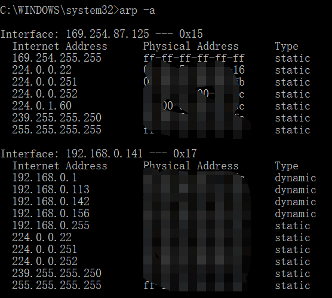

交换机有MAC地址表，无ARP表，MAC地址表一般存在在交换机中

## arp

troubleshooting intranet access issue raised by wrong arp

I got an issue access the shared folder on the other pc in the same intranet at home, actually it was working fine a few days ago.
both pc are win10 os.

without firm knowlege on networking I started to google without thinking, tried all the online suggestions but no luck;

ok, it could be something wrong either on my win10 or the other one, so I turned off firewall, started all the "file and printer sharing" realted services, turned on sharing for private/public network, grant remote access to both everyone and guest with full permissions, 
even tried modify regedit(registry editor) to enable AllowInsecureGuestAuth, still no luck;

finally I come to think of ping, source ip:192.168.0.141, target ip:192.168.0.113, so ping 192.168.0.113 result in:
```
Pinging 192.168.0.113 with 32 bytes of data:
Reply from *192.168.0.141*: Destination host unreachable.
```
the ip "Reply from " is the source machine, it indicates that it's something wrong with the source machine, 
then I run 'arp -a', 

now things get a bit clear, the target ip isn't in the arp table, I tried arp -d to reset arp, but not working, so I decided the easiest way is to restart router to clear the arp table;
after restarting router, all settled!

finally thoughts: I should spare some time to learn networking.
refer:
https://www.coursera.org/learn/network-protocols-architecture

整理了8张图详解ARP原理
https://zhuanlan.zhihu.com/p/395157603


## 传统二层交换机

普通家庭网络+小区机房（）
例子：
网络核心设备是放置于小区机房或大厦机房的光纤交换机，该光纤交换机通过光纤以1000M/100M速率与Internet边缘路由器或汇集交换机相联，实现小区网络接入Internet。光纤交换机通过光纤和点对点的方式以双工100M速率与放置在用户家中的光网络单元或内置光纤以太网卡相联，实现用户通过光纤高速接入Internet。光纤交换机与光网络单元的链接是选择单纤双向方式 。

[大户型家庭网络](https://www.zhihu.com/question/40558723)

## 三层交换机

不同VLAN之间相互通信的两种方式(单臂路由、三层交换机)。

单臂路由的实现方式，其实就是普通二层交换机加路由器，从而实现不同vlan间的可以互相通信。

对于小型的网络，单臂路由可以应付，但随着VLAN之间流量的不断增加，很可能导致路由器成为整个网络的瓶颈，出现掉包、或者通信堵塞。

为了解决上述问题，三层交换机应运而生。三层交换机，本质上就是“带有路由功能的(二层)交换机”。路由属于OSI参照模型中第三层网络层的功能，因此带有第三层路由功能的交换机才被称为“三层交换机”。

交换机排查 https://www.dgzj.com/tongxin/91652.html