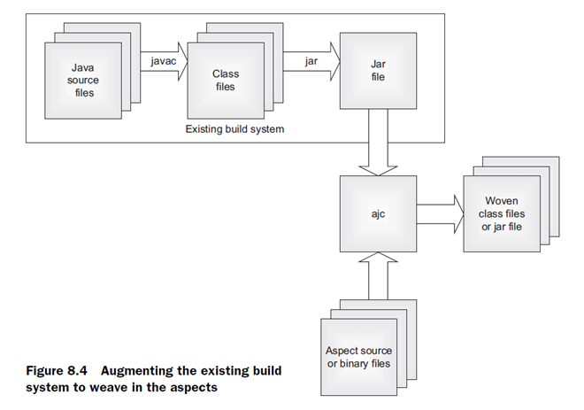
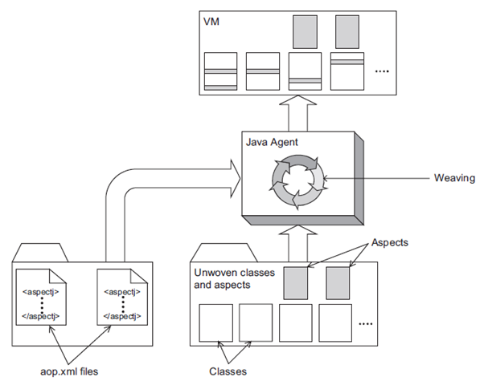

AOP是aspect oriented programing的简称，意为面向切面编程，对OOP的补充。 

AOP is used along with spring Ioc to provide a very capable middleware solution.

Note: Cross cutting concerns are one of the concerns in any application such as logging, security, caching, etc. They are present in one part of the program but they may affect other parts of the program too.

## 概念对比

通知（Advice）包含了需要用于多个应用对象的横切行为，完全听不懂，没关系，通俗一点说就是定义了“什么时候”和“做什么”。It’s the behavior that addresses system-wide concerns (logging, security checks, etc…). This behavior is represented by a method to be executed at a JoinPoint. This behavior can be executed Before, After, or Around the JoinPoint according to the Advice type as we will see later.

interceptor == Advice

连接点（Join Point）是程序执行过程中能够应用通知的所有点。a JoinPoint is a point in the execution flow of a method where an Aspect (new behavior) can be plugged in.

切点（Poincut）是定义了在“什么地方”进行切入，哪些连接点会得到通知。显然，切点一定是连接点。A Pointcut is an expression that defines at what JoinPoints a given Advice should be applied.

切面（Aspect）是通知和切点的结合。通知和切点共同定义了切面的全部内容——是什么，何时，何地完成功能。Aspect is a class in which we define Pointcuts and Advices.

引入（Introduction）允许我们向现有的类中添加新方法或者属性。

织入（Weaving）是把切面应用到目标对象并创建新的代理对象的过程，分为编译期织入、类加载期织入和运行期织入。

### java aop(aspectj) VS spring aop

[Comparing Spring AOP and AspectJ](https://www.baeldung.com/spring-aop-vs-aspectj)
[Spring JDK Proxies vs CGLIB vs AspectJ](https://www.credera.com/insights/aspect-oriented-programming-in-spring-boot-part-2-spring-jdk-proxies-vs-cglib-vs-aspectj)


### spring web mvc http拦截

MVC Interceptor is a MVC only concept. They are more or less like Servlet Filters. They can intercept requests to the controller only. AOP can be used to intercept calls to any public method in any Spring loaded bean.

[rpc系列5-添加拦截器链，实现rpc层面的AOP](https://www.jianshu.com/p/64355d8cb1ee)
在spring web mvc中实现拦截功能时，有三种方式

1. 使用功能servlet filter

2. 使用springmvc 提供的 HandlerInterceptor

3. 使用spring core 提供的 MethodInterceptor（spring aop）

#### servlet的过滤器Filter
我们自己写的Filter类，Filter是Servlet规范的一部分，是Servlet容器（如Tomcat）实现的。

在spring boot下注册一个filter的三种方式（servlet、listener也是如此）

方式1：可以使用@WebFilter+@ServletComponentScan的方式

方式2：可以使用FilterRegistrationBean 进行API级别的注册，注意，在这种情况下可以对Filter order进行设置，而使用spring @Order注解是无效的
```
@Bean
public ServletRegistrationBean asyncServletServletRegistrationBean(){
    ServletRegistrationBean registrationBean =  new ServletRegistrationBean(new AsyncServlet(),"/");
    registrationBean.setName("MyAsyncServlet");
    registrationBean.setOrder(Ordered.HIGHEST_PRECEDENCE);
    return registrationBean;
}
```
方式3：创建一个类去实现 ServletContextInitializer 接口，并把它注册为一个 Bean，Spring Boot 会负责调用这个接口的 onStartup 方法。
```
@Bean
public ServletContextInitializer servletContextInitializer() {
    return servletContext -> {
        CharacterEncodingFilter filter = new CharacterEncodingFilter();
        FilterRegistration.Dynamic registration = servletContext.addFilter("filter", filter);
        registration.addMappingForUrlPatterns(EnumSet.of(DispatcherType.REQUEST), false, "/");
    };
}
```
FilterRegistrationBean其实也是通过 ServletContextInitializer 来实现的，它实现了 ServletContextInitializer 接口

特点：
可以拿到原始的http请求和响应的信息，但是拿不到真正处理这个请求的方法的信息

存在的问题：
通过Filter只能拿到http的请求和响应，只能从请求和响应中获得一些参数。当前发过来的这个请求实际上真正是由哪个控制器的哪个方法来处理的，在Filter里面是不知道的，因为javax.servlet.Filter是J2EE规范中定义的，J2EE规范里面实际上并不知道与spring相关的任何内容。而我们的controller实际上是spring mvc定义的一套机制。如果你需要这些信息，那么就需要使用拦截器Interceptor

#### springmvc的拦截器Interceptor

在我们真正访问的Controller的某个方法被调用之前，会调用preHandler方法，在Controller的方法调用之后，会调用postHandler方法，如果你的controller中的方法抛出了异常，那么postHandler这个方法不会被调用。但无论controller中的方法是否抛出异常，afterCompletion方法都是会被调用的。

```
public class TimeInterceptor implements HandlerInterceptor {}

@Override
public boolean preHandle(HttpServletRequest request, HttpServletResponse response, Object handler){}

最后一个参数，Object handler，这个是我真正用来处理这个请求的Controller的方法声明

public void postHandle(HttpServletRequest request, HttpServletResponse response, Object handler, ModelAndView modelAndView) throws Exception {}
```

## AspectJ
跟 spring aop的区别是：
1.apsectj支持自我调用的时候也能触发AOP 代码
2. spring aop是run time weaving，而aspectj:
Build-time weaving weaves classes and aspects together during the build process before deploying the application.
Load-time weaving (LTW) weaves just in time as the classes are loaded by the VM, obviating any pre-deployment weaving.

### 原理
[Different Types of AspectJ Weaving](https://dzone.com/articles/different-types-of-aspectj-weaving)

#### Compile-time Weaving

The weaving process in compile-time weaving happens (obviously) at compile time. As you can see from the diagram above, the left-hand side describes our source codes which are java files, java classes with @Aspect annotation, and the last one are traditional aspect classes. They are then compiled by ajc (AspectJ Compiler) to be woven into a compiled class called woven system. To give more perspective on this, take a look at several code snippets below.
```
Target class to be woven:
@Component
public class Target {
  public void greet(String name) {
    System.out.println("[Actual] Hi " + name + " from target!");
  }
}

Before Advice:
@Aspect
@Component
public class GdnBeforeAspect {
  @Before("execution(* greet(..))")
  public void beforeGreet(final JoinPoint joinPoint) {
    doBefore(joinPoint);
  }
  private void doBefore(final JoinPoint joinPoint) {
    System.out.println("[ASPECTJ BEFORE]");
    System.out.println("Target class' name: " + joinPoint.getTarget().getClass());
    System.out.println("Target method's name: " + joinPoint.getSignature().getName());
    System.out.println("Target method's arguments: " + Arrays.toString(joinPoint.getArgs()));
    System.out.println("[ASPECTJ BEFORE]");
  }
}
Those 2 code snippets are just regular steps to do if we want to do AOP. The 2 snippets above mean that we want to advise the greet() method (which resides inside Target class) with before advice. Nothing fancy happens in the aspect, it’ll just print some information about the method invocation.

Now, this is where something is getting interesting. Let’s define a plugin inside our pom.xml.
AspectJ Maven Plugin:
<plugin>
                <groupId>org.codehaus.mojo</groupId>
                <artifactId>aspectj-maven-plugin</artifactId>
                <version>1.11</version>
                <configuration>
                    <complianceLevel>1.8</complianceLevel>
                    <source>1.8</source>
                    <target>1.8</target>
                    <showWeaveInfo>true</showWeaveInfo>
                    <verbose>true</verbose>
                    <Xlint>ignore</Xlint>
                    <encoding>UTF-8 </encoding>
                </configuration>
                <executions>
                    <execution>
                        <goals>
                            <!-- use this goal to weave all your main classes -->
                            <goal>compile</goal>
                        </goals>
                    </execution>
                </executions>
            </plugin>
The AspectJ Maven plugin stated above will weave the aspects when we execute mvn clean compile. Now, let’s try to do just that and see what happens.
If you see inside the target directory (which consists of every compiled class) and open Target.class, you’ll see this.

Target class woven using CTW (Compile-time Weaving):
@Component
public class Target {
  public Target() {
  }
  public void greet(String name) {
    JoinPoint var2 = Factory.makeJP(ajc$tjp_0, this, this, name);
    GdnBeforeAspect.aspectOf().beforeGreet(var2);
    System.out.println("[Actual] Hi " + name + " from target!");
  }
  static {
    ajc$preClinit();
  }
}
You see that on lines 7–8, the compiler inserts additional functionality which calls the aspect we defined before. This way, the before advice will be executed before the actual process done by the target. Now you know how CTW works internally.

```
#### Post-compile (binary) weaving


Basically, binary weaving is similar to CTW (Compile-time Weaving), the weaving process is also done on compile-time. The difference is that with Binary Weaving, we’re able to weave aspects into 3rd party library’s source code. Let’s take a look at the code snippets below.

```
Add the new library as dependency to our main project’s pom.xml:
<dependency>
            <groupId>com.axell</groupId>
            <artifactId>aspectj-aop-lib</artifactId>
            <version>0.0.1-SNAPSHOT</version>
        </dependency>
Advising greetFromLib() method which exists inside our 3rd party library added previously:

@Aspect
@Component
public class GdnBeforeAspect {
  @Before("execution(* greetFromLib(..))")
  public void beforeGreetLib(final JoinPoint joinPoint) {
    doBefore(joinPoint);
  }

  private void doBefore(final JoinPoint joinPoint) {
    System.out.println("[ASPECTJ BEFORE]");
    System.out.println("Target class' name: " + joinPoint.getTarget().getClass());
    System.out.println("Target method's name: " + joinPoint.getSignature().getName());
    System.out.println("Target method's arguments: " + Arrays.toString(joinPoint.getArgs()));
    System.out.println("[ASPECTJ BEFORE]");
  }
}
At this point, we know that greetFromLib() exists inside our 3rd party library, which means in form of .jar file instead of our own written source codes. We need to do several modifications to our AspectJ Maven plugin to accommodate this.

Adding our third-party lib into weave dependency to be woven:
<plugin>
...
                <configuration>
                    ...
                    <weaveDependencies>
                        <weaveDependency>
                            <groupId>com.axell</groupId>
                            <artifactId>aspectj-aop-lib</artifactId>
                        </weaveDependency>
                    </weaveDependencies>
                </configuration>
...
</plugin>
Now that we’ve added necessary information to our AspectJ maven plugin, we simply just have to execute mvn clean compile again, and let’s see what changes inside our target directory.

TargetLib class woven using Binary Weaving:
public class TargetLib {
  public TargetLib() {
  }
  public void greetFromLib(final String name) {
    JoinPoint var2 = Factory.makeJP(ajc$tjp_0, this, this, name);
    GdnBeforeAspect.aspectOf().beforeGreetLib(var2);
    System.out.println("[ACTUAL] Hi " + name + " from target lib!");
  }
  static {
    ajc$preClinit();
  }
}
Similar to what we’ve observed from CTW, the TargetLib class (in which the source code exists on 3rd party library, we don’t host the source code in our main project) got woven by Binary Weaving by using a similar mechanism.
```
#### Load-time weaving


Load-time weaving happens when the classes are about to be loaded into JVM. This means that after compilation, nothing will be added into our compiled classes (unlike CTW and Binary Weaving).
+ Deploy an application.
+ VM initializes the weaving agent.
+ The weaving agent loads all aop.xml files (Yes, we can define multiple aop.xml files and everything gets loaded).
+ Weaving agent loads listed aspects in aop.xml files.
+ The system starts normal execution.
+ VM loads classes during execution (as usual).
+ The VM notifies the weaving agent whenever it loads a class.
+ The weaving agent (after being notified), inspects the to-be-loaded class to determine if any of the aspects need to be woven to the to-be-loaded class.
+ If so, the weaving agent will weave the class and the aspect.
+ The woven byte code will be loaded to VM and used.


### 用法

[Intro to AspectJ](https://www.baeldung.com/aspectj)

handle self-invocation within one class:
https://stackoverflow.com/questions/49159666/how-to-intercept-each-method-call-within-given-method-using-spring-aop-or-aspect

https://blog.csdn.net/gavin_john/article/details/80252414

## Spring(Boot) AOP

### 原理

Spring AOP uses either JDK dynamic proxies or CGLIB to create the proxy for a given target object. JDK dynamic proxies are built into the JDK, whereas CGLIB is a common open-source class definition library (repackaged into spring-core).

If the target object to be proxied implements at least one interface, a JDK dynamic proxy is used. All of the interfaces implemented by the target type are proxied. If the target object does not implement any interfaces, a CGLIB proxy is created.

利用[动态代理](/software/highlevel/designpattern.md#proxy)也能实现AOP(spring aop vs aspectj)：动态代理提供了一种方式，能够将分散的方法调用转发到一个统一的处理函数处理。AOP的实现需要能够提供这样一种机制，即在执行函数前和执行函数后都能执行自己定义的钩子。那么，首先使用动态代理让代理类忠实的代理被代理类，然后处理函数中插入我们的自定义的钩子。之后让代理类替换被代理类需要使用的场景，这样，相当于对该类的所有方法定义了一个切面。

spring aop使用了动态代理技术在运行期织入增强的代码，使用了两种代理机制：
一种是基于jdk的动态代理，另一种是基于CGLib的动态代理。
详细请看深入理解代理模式设计模式：代理模式

在spring中，Advice的实现接口就是Interceptor

注意，Advice和Interceptor都是在org.aopalliance包下，并非在spring包下，为spring引入的外部依赖

Interceptor接口在spring中的实现类MethodInterceptor，通过before, after, afterReturing, afterThrowing等增强器来对目标方法进行增强

spring aop源码解析参考：[spring aop源码解析1: 创建、初始化并注册AnnotationAwareAspectJAutoProxyCreator](https://blog.csdn.net/u013905744/article/details/91852692)


AOP API: MethodInterceptor


managed components & proxy(jdk proxy&cglib)

> Whenever you declare a bean in XML or use @Component, @Service, or @Repository on a class targeted by Spring’s annotation component scanning (which is enabled by default for Spring Boot), that class is instantiated and managed as a singleton bean by the Spring framework.
> However, Spring doesn’t actually provide a literal reference to the original bean when it’s injected—it wraps the bean in a proxy class to give Spring a chance to weave in AOP code if needed.
https://docs.spring.io/spring/docs/2.5.x/reference/aop.html

https://www.credera.com/blog/technology-insights/open-source-technology-insights/aspect-oriented-programming-in-spring-boot-part-2-spring-jdk-proxies-vs-cglib-vs-aspectj/

### 用法
#### Spring AOP
https://www.baeldung.com/spring-aop

#### Springboot AOP starter
```
<dependency>
    <groupId>org.springframework.boot</groupId>
    <artifactId>spring-boot-starter-aop</artifactId>
</dependency>
```
AOP in Spring, if you have an interface, use the JDK dynamic proxy, no interface, use Cglib dynamic proxy.
Spring Boot AOP, before 2.0 and Spring the same; 2.0 after the preferred Cglib dynamic proxy, if users want to use JDK dynamic proxy, you need to manually configure their own.
- https://www.springcloud.io/post/2022-01/springboot-aop/#gsc.tab=0

[Spring Boot使用AOP的正确姿势](https://www.cnblogs.com/sgh1023/p/13363679.html)

## example:
### log 使用AOP做日志切面
```
<dependency>
    <groupId>org.springframework.boot</groupId>
    <artifactId>spring-boot-starter-aop</artifactId>
</dependency>

@Aspect	// 添加Aspect注解
@Component	// 注册为SpringBean
public class LogAspect {
    
    private static final Logger log = LoggerFactory.getLogger(LogAspect.class);
    
    // 定义该切面的切入点为allCtlMethod(), 需要被切入的方法为: ctl这个包下的所有带@RequestMapping, @PostMapping, @GetMapping的方法
    @Pointcut("execution(* com.welldone.calcprogram.ctl..*.*(..)) "
            + "&& "
            + "(@annotation(org.springframework.web.bind.annotation.RequestMapping)"
            + "|| @annotation(org.springframework.web.bind.annotation.PostMapping)"
            + "|| @annotation(org.springframework.web.bind.annotation.GetMapping)"
            + ")"
    )
    public void allCtlMethod() {}
	
    
    /** allCtlMethod()指定的目标方法执行前执行before方法
     * @param call 切入点，即目标方法
     */
    @Before("allCtlMethod()")
    public void before(JoinPoint call) {
        if (log.isInfoEnabled()) {
            String clazzName = call.getTarget().getClass().getName();
            String methodName = call.getSignature().getName();
            Object[] args = call.getArgs();
            StringBuffer sb = new StringBuffer()
                    .append("[start]").append(clazzName).append(".").append(methodName).append(", args: ");
            for (Object arg : args) {
                sb.append(arg);
            }
            log.info(sb.toString());
        }
    }
    
	/** allCtlMethod()指定的目标方法返回后执行afterReturning方法
		returning的值要和Object的参数名obj一致
     * @param call 切入点，即目标方法
     * @param obj 目标方法返回值
     */
    @AfterReturning(pointcut = "allCtlMethod()", returning = "obj")
    public void afterReturning(JoinPoint call, Object obj) {
        if (log.isInfoEnabled()) {
            String clazzName = call.getTarget().getClass().getName();
            String methodName = call.getSignature().getName();
            String output = obj != null ? obj.toString() : "";
            log.info("[end]" + clazzName + "." + methodName + ", returnValue: " + output);
        }
    }
}


```

https://stackoverflow.com/questions/38494974/use-spring-aop-and-get-respective-class-name-in-log-file

### MyBatis Plugin插件开发
Spring / MyBatis——插件机制（AOP）
https://blog.csdn.net/qq_22078107/article/details/85781594
https://blog.csdn.net/u012525096/article/details/82389240

[记一次Spring的aop代理Mybatis的DAO所遇到的问题](https://www.cnblogs.com/study-everyday/p/7429298.html)


---
refer:
[spring aop(MethodInterceptor), springmvc (HandlerInterceptor), servlet Filter有什么区别？](https://blog.csdn.net/u013905744/article/details/91363203)

使用spring的MethodInterceptor实现aop功能的三种方式 https://blog.csdn.net/u013905744/article/details/91364736

Why in Spring AOP the object are wrapped into a JDK proxy that implements interfaces? https://stackoverflow.com/questions/29650355/why-in-spring-aop-the-object-are-wrapped-into-a-jdk-proxy-that-implements-interf